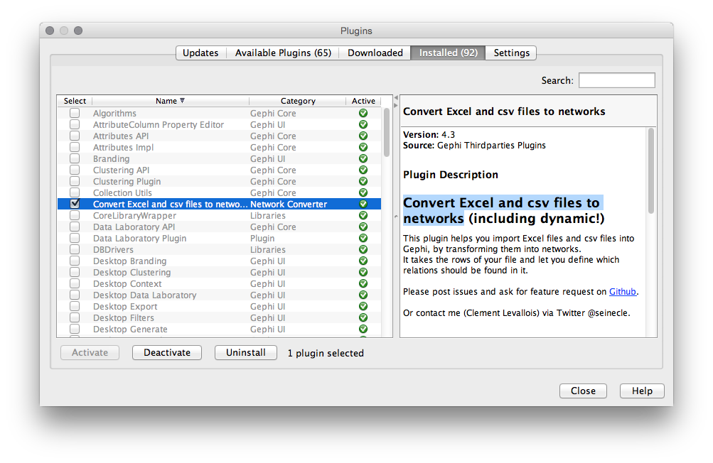
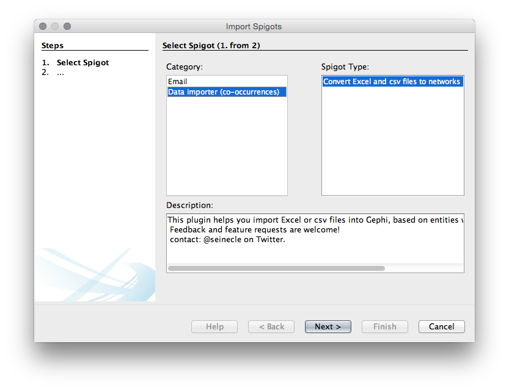
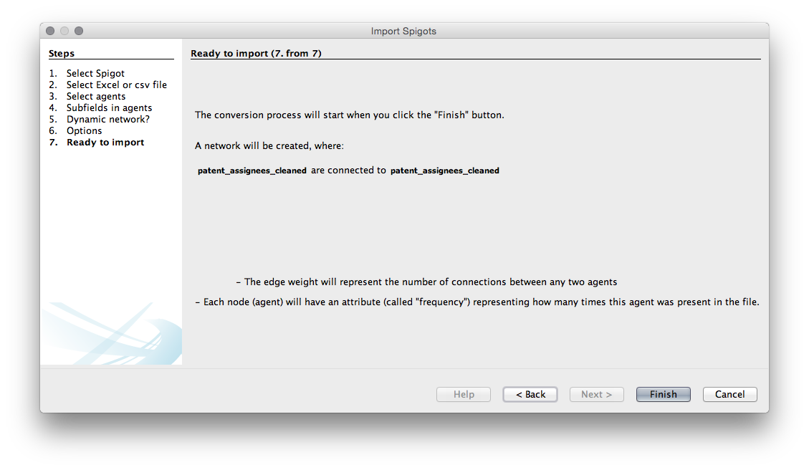
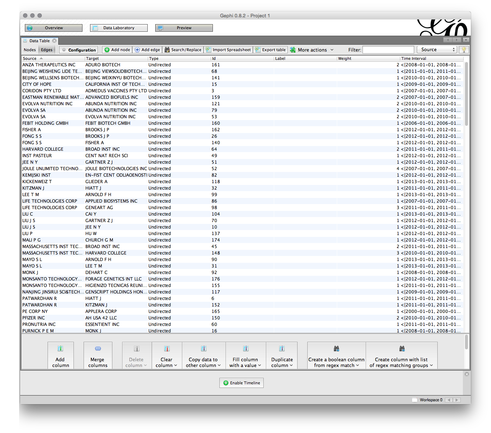
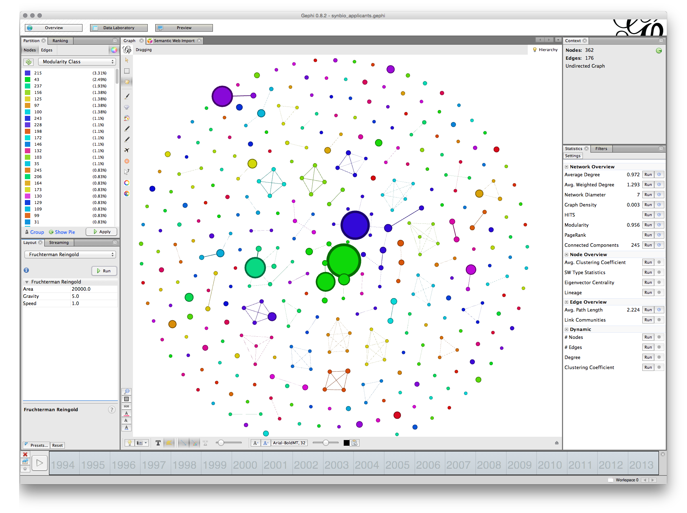
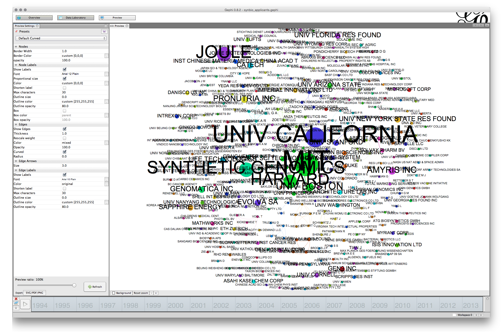

#Gephi

<!---update dataset links--->
This chapter focuses on visualising patent data in networks using the open source software [Gephi](http://gephi.github.io). Gephi is one of a growing number of free network analysis and visualisation tools with others including [Cytoscape](http://www.cytoscape.org), [Tulip](http://tulip.labri.fr/TulipDrupal/), [GraphViz](http://www.graphviz.org), [Pajek](http://mrvar.fdv.uni-lj.si/pajek/) for Windows, and [VOSviewer](http://www.vosviewer.com/Home) to name but a few. In addition, network visualisation packages are available for R and Python. We have chosen to focus on Gephi because it is a good all round network visualisation tool that is quite easy to use and to learn. 

In this chapter we will focus on creating a simple network visualisation of the relationship between patent applicants (assignees). However, network visualisation can be used to visualise a range of fields and relationships, such as inventors, key words, IPC and CPC codes, and citations among other options. 

For this chapter we will use the synthetic biology patent dataset developed by Paul Oldham based on a simple worldwide search of the Thomson Innovation database using the key terms `"synthetic biology" or "synthetic genomics" or "synthetic genome" or "synthetic genomes"`(for background see this [article](http://journals.plos.org/plosone/article?id=10.1371/journal.pone.0034368)). The dataset consists of 576 first filings of patent applications (INPADOC families) linked to 2,882 INPADOC Family Members worldwide. The dataset has been extensively cleaned and the cleaning steps are described in detail in the codebook [here](https://github.com/poldham/opensource-patent-analytics/blob/master/2_datasets/synbio_patents/synbio_patents_code_book_12052015.txt). The dataset has been developed to provide an insight into the emergence of patent activity for synthetic biology. However, it does not provide the complete patent landscape for this emerging field. In addition, this dataset provides a useful sample of the range of data fields that are available from the commercial [Thomson Innovation](http://info.thomsoninnovation.com) platform. 

We will use the Excel version of the dataset in this chapter and it can be downloaded [here](https://github.com/poldham/opensource-patent-analytics/blob/master/2_datasets/synbio_patents/synbio_inventors.xlsx?raw=true). 

##Installing Gephi

Gephi is the subject of ongoing development and as with many other open source tools this has advantages and disadvantages. In the case of Gephi the issues are as follows. 

1. The latest release of Gephi (version 9.1 at the time of writing) is a considerable improvement on the previous version because it removes dependency on an old version of Java. However, the Plug Ins that make it easier to work with Gephi - notably to import data directly from Excel files - have not yet been updated. This makes it harder than it should be to import data into Gephi. 

2. Version 8.2 allows you to easily import Excel files using an Add In. However, it suffers from an issue that the Java version on your machine may not be the version required by Gephi (notably for Windows and Mac users). This can be frustrating to fix although clear instructions that work are available.

In this chapter we will use Version 8.2. 

To install Gephi 82. for Windows use this link to directly download the [.exe](https://github.com/gephi/gephi/releases/download/v0.8.2/gephi-0.8.2-beta.setup.exe) file. To install for Mac OSX download the [.dmg](https://github.com/gephi/gephi/releases/download/v0.8.2/gephi-0.8.2-beta.dmg) file. 
Then try installing the software. If all goes well you should see the Welcome Screen below with Welcome to Gephi when you open Gephi 8.2. If you do not see the Welcome screen or everything is grey then you need to install the version of Java that Gephi is expecting. To do that for Windows follow these [instructions](https://github.com/poldham/opensource-patent-analytics/raw/master/6_workshop_presentations/gephi_installation.pdf) to install Java 7. The instructions have been tested in two regional workshops and they work. The key to success is to uninstall Gephi if you have already installed it, install Java 7 and then reinstall Gephi v8.2.

Mac users who experience issues with installing Gephi 8.2 should follow the instructions  [here](http://sumnous.github.io/blog/2014/07/24/gephi-on-mac/). If those don't work try this more [detailed account](https://lbartkowski.wordpress.com/2014/11/28/gephi-0-8-2-on-apple-osx-yosemite/). Again, these instructions have been tested and they will work. 

After you have finished this chapter you may want to follow the [Quick start guide](https://gephi.github.io/tutorials/gephi-tutorial-quick_start.pdf) although we will cover those topics in the article. The [Learn section](http://gephi.github.io/users/) of the website provides additional tutorials. 

##Opening Gephi and Installing Plugins

When you have installed Gephi, open it and you should see the following welcome screen. 

Before we do anything else, we need to install a plugin developed by [Clement Levallois](http://www.em-lyon.com/en/faculty-research-education/faculty-research/international-business-school-professors/Permanent-Professors/Clement-LEVALLOIS) to convert Excel and csv files into gephi network files. To install the plugin select the `Tools` menu in the menu bar and then `Plugins`.

You will see a pop up menu for the plugins. At this point you may want to press `Reload Catalog` to make sure everything is loaded. Then head to `Available Plugins`. Click on `name` to sort them alphabetically. You now want to look for a plugin called `Convert Excel and csv files to networks`. Select the check box and then `Install`. 

While you are here, one very useful plugin that is not installed by default is `Nooverlap`. This is very helpful for preventing nodes in network maps from overlapping. Find this plug in and install it now or you will need to do this later. 

You will need to restart Gephi for it to take effect but if you return to the Plugins menu and then choose the installed tab you should see this.

You are good to go. While you are there you may want to check out the other plugins to get an idea of what is available. For more on the conversion plugin see this description [Excel/csv converter to network plugin](https://marketplace.gephi.org/plugin/excel-csv-converter-to-network/).

##Importing a file to Gephi with the converter plugin

We will concentrate on using the `synbio` patent dataset in the Excel version [here](https://github.com/poldham/opensource-patent-analytics/blob/master/2_datasets/synbio_patents/synbio_inventors.xlsx?raw=true). While Gephi works with .csv files, the import plugin includes a timeline option that only works with Excel. For that reason we will use the Excel version.

###Step 1. Open Gephi and Choose File > Import Spigot

For this to work we need to use the `Import Spigot` function under the File menu. You should see a menu like that below. Make sure that you choose the co-occurrence option.

When you have chosen `Data importer(co-occurrences)` then choose `Next`. Make sure the column headers stays selected (unless using your own data). You will then need to choose a delimiter. In this case it is a comma but in other cases it may be a semicolon or a tab. Select the `synbio.xlsx` file that you have downloaded from [here](https://github.com/poldham/opensource-patent-analytics/blob/master/2_datasets/synbio_patents/synbio_inventors.xlsx?raw=true).

We now need to choose the agents, that is the actors or objects that we want to create a network map with. We will use `patent_assignees_cleaned` as this is a relatively small set. We will choose the same field in the two boxes because we are interested in co-occurrence analysis. 

In the next step we need to specify the delimiter for splitting the contents of the `patent_assignees_cleaned` column. In all the fields it is a semicolon so let's choose that. 

We will then be asked if we want a dynamic network. This presently only works with Excel files so in this case we are using the Excel version. Because this dataset has been deduplicated on first filings (INPADOC First Family Member Numbers) we will select the `priority_year_earliest` field as below for our time series filter. That will give use the year that is closest to the research and development that led to the submission of the original application. 

The next menu provides us with a list of options. Unfortunately, with one exception, it is not entirely clear what the consequences of these choices are so experimentation may be needed.

Choice1. Create links between `patent_assignees_cleaned`.
Choice 2. remove duplicates. We don't need that as we know that they are unique
Choice 3. remove self-loops. Generally we do want this (otherwise known as removing the diagonal to prevent actors counting against themselves). 

We will choose to create the links and to remove the self loops. 

Next we will see a create network screen setting out our choices. 

Press Finish

Next we will see an import screen. 

We will often see a message telling us that there is a problem with the year field not being correctly formatted. It is not clear what this actually means but check the data in the data laboratory after import if this happens (see below). 

We have left the defaults as is. Note that this is an undirected graph (meaning that we do not believe there is a causal relationship between any of the elements in the data). Undirected is generally the default for patent data. 

Note that Gephi is telling us that there are 362 nodes in the network and 176 edges (links). That suggests that this is quite a sparse graph in terms of connections and clusters. 

Click OK. You should now see a raw network that looks like this. 

We can now see a set of tabs in the top left. Before we go any further let's take a look at the `Data Laboratory`. When we look in the `Nodes` we can see that under frequency (the count of our publication records) the highest value is for NA for Not Available. The reason for this is that we have focused on mapping patent applicants that are organisations (rather than the names of individuals). 

To remove the NA values right click and select Delete. Then confirm the deletion. This will prevent NA from showing up as a large node on the network diagram. Note that you can always exclude nodes after you have laid out the network. 

While we are here in the data laboratory let's note the division of the data into two sections. 
1. A set of nodes. 
2. A set of edges. 

The nodes are the organisations (or inventors, keywords etc.). In this case the frequency refers to a count of the number of times an organisation name appears and is very close to, bout not quite matching, the count of records in the set . Note that it is possible to export the nodes table as a .csv file to add information to it and then reimport it. If choosing this option it is generally best to first sort the nodes table alphabetically as it is easier to get right. 

The edges table involves a source and a target, where the source is the source node and the target is another node where there is a link between the nodes. We can see the edges table sorted alphabetically (click the source heading to sort) where the value in weight is the number of shared records.

Again, note that it is possible to export the edges set and import a set. Also note the menus at the bottom of the screen which allow column values to be copied over. This can be useful where the label value is not populated meaning that a name will not display on the node when the graph is laid out.

Most of the time we can simply proceed with laying out the network without paying much attention to the data laboratory. However, it is important to become familiar with the data laboratory to avoid unexpected problems or to spot corruption in the data.

In this case we will also see a small box with `Enable Timeline` at the bottom of the screen. Click to enable it and we will see a list of years. This is a tool for mapping the emergence of networks over time and we will come back to it shortly. 

##Sizing and Colouring Nodes

When we look at the Overview screen we have quite a wide range of options. We will start on the upper right with the Statistics panel. 

The `Run` buttons will calculate a range of statistics on the network. Probably the two most useful are: 

1. Modularity Class. This algorithm iterates over the connections (edges) and allocates the nodes to communities or clusters based on the strength of the connections. This algorithm is explained in detail in this article [Vincent D Blondel, Jean-Loup Guillaume, Renaud Lambiotte, Etienne Lefebvre, Fast unfolding of communities in large networks, in Journal of Statistical Mechanics: Theory and Experiment 2008 (10), P1000](http://arxiv.org/abs/0803.0476). The ability to detect communities in networks based on the strength of connections is a powerful tool in patent analytics.
2. Network Diameter. This calculates two measures of `betweeness`, that is `betweeness centrality` (how often a node appears on the shortest path between nodes) and centrality(the average distance from a starting node to other nodes in the network). Network Diameter also calculates Eccentricity which is the distance between a given node and the farthest node from it in the network. For background on this see the Wikipedia entry and also [Ulrik Brandes, A Faster Algorithm for Betweenness Centrality, in Journal of Mathematical Sociology 25(2):163-177, (2001)](http://www.inf.uni-konstanz.de/algo/publications/b-fabc-01.pdf)

Whereas Modularity Class identifies communities (particularly in large networks), centrality measures examine the position of a node in the graph relative to other nodes. This can be useful for identifying key actors in networks based on the nature of their connections with other actors (rather than simply the number of records). 

If we run Modularity Class as in the figure a pop up message will inform us that there are 246 communities in the network. Given that there are only 362 nodes this suggests a weakly connected network made up of small individual clusters. 

Move over to the left where it says Ranking and then select the red inverted triangle. Set the largest value to 200 and the smallest to 20 (it is up to you what you choose). Then apply. The network will now change. 

You can always change the node size later. But in general a size between 10 and 20 for the smallest nodes will allow labels to be seen in later steps. 

To set the colour choose the small colour wheel next to the size nodes triangle. To change the colour select the small square to the right of the colour slider as seen below.

An alternative way of colouring the graph is to select the partition tab to the left of the ranking tab. A small green arrow appears next to a blank drop down menu. Click the arrow button to activate the drop down and choose an option. In this case we have chosen Modularity Class. This will partition the network into coloured groups based on the choice we make. To change the colour of the groups right click and choose randomise colours.  

There are a range of other options for colouring nodes including a colour plugin that will detect if a column with a colour value is present. 

##Laying out the Graph

In the bottom left panel called Layout in the figure above there are a range of network visualisation options with more that can be imported from the plugin menus. Among the most useful are Fruchterman-Reingold, Force Atlas, OpenOrd and Circular with specialist plugins for georeferenced layouts that are well worth experimenting with. 

We will illustrate network layout using Fruchterman-Reingold. The first setting is the area for the graph. The default is 10,000 but we will start with 20,000 because 10,000 tends to be too crunched. The default for the gravity setting is 10. This is intended to stop the nodes dispersing too far but is often too tight when labels are applied. Try changing the setting to 5 (which reduces the gravitational pull). The settings in the different layout options can take some getting used too and it is worthwhile creating a record of useful settings. Gephi does not save your settings so make sure you write down useful settings. 

We are now good to go. But, before we start take note of two important options for later use. 

The first is the NoOverlap plugin we installed above. This will help us to deal with overlapping nodes after layout. The second is Expansion which will help us to increase the size of a network are to make it easier to see the labels. Note also the Contraction option which will allow us to pull a network back in if it expands too far. 

Now make sure that Fruchterman-Reingold is selected with the settings mentioned above and click `Run`. 

You can leave the network to run and the nodes will start to settle. If the network disappears from view (depending on your mouse) try scrolling to zoom out. Our aim is to arrive at a situation where lines only cross through nodes where they are connected. As you become more experienced with layout you may want to assist the nodes with moving into a clear position for a tidier graph. 

You will now have a network that looks something like this (note that 15,000 for the Area may have been enough). 

We can see that some of the nodes are set very close together. That will affect the ability to label the nodes in a clear way. To address this we first use the NoOverlap function and later we may want to use the Expansion function in the Layout drop down menu items. 

Choose nooverlap from the menu and Run. 

While the difference is minor in this case we have at least moved the nodes into separate positions. 

At this stage we will save our work. One feature of Gephi as a Java programme is that there is no undo option. As a result it is a good idea to save work at a point where you are fairly happy with the layout as it stands. 

Go to File and choose Save As and give the file name a `.gephi` extension. Do not forget to do this or gephi will not know how to read the file. If all goes well the file will save. On some occasions Java throws an exception and you will basically have to start again. That is one reason to save work in Gephi regularly because it is a beta programme and subject to the predilections of Java on your computer. 

##Adding Labels

The next step is to add some labels. In the bottom menu bar there are a range of options. What we want is the small grey triangle on the right of this menu bar that will open up a new bar. Click in the triangle and you will see a set of options. Choose labels and then at the far left check the `Node` box. We will not see any labels yet. 

To the right is a menu with size. This is set to scaled. To see some labels move the scale slider as far as it will go. We will see labels come into view and a first hint that we will need to do some more work on laying out the graph to make it readable. 

Next, change size to Node Size, the screen will now fill with text. Go to the scaler and pull it back until there is something more or less readable

At this stage we may want to edit the labels to make them less long but still meaningful. Go to the Observatory and Nodes and sort on frequency. Change Massachusetts Institute of Technology to MIT, Joule Technology to Joule, Leland Stanford Junior to Stanford and Harvard College to Harvard. You may want to take the INC off Synthetic Genomics. Somewhat inconveniently when we edit in the labels column we have to resort each time. Generally speaking shorter labels are better. However, you will probably want to avoid masses of abbreviations and to ensure that any modifications are appropriately explained in the text for example the California Institute of Technology is CALTECH. 

You will now have something that looks more or less like this. 

Note that you can use the slider to the right in the bottom menu to adjust the sizes and you could of course adjust the font. In some cases you may be happy with a rough and ready network rather than the detailed adjustments that are required for a final network graph. 

Note the small camera icon on the left of the bottom menu. Either press that to take a screenshot or hold to bring up a configure menu that will allow you to choose a size. 

If you pursuing this option you may also want to adjust the font or the colour and to use the bottom menu to arrive at a result you are happy with for display.

##Using the Timeline

The timeline option requires a data field or it will not be available. To use it select one end of the timeline and drag it to the desired point. The image below shows first filings of patent applications using the selected simple terms for synthetic biology. 

This could be an indicator of early use of these terms and foundational patent documents but requires investigation. As we scroll forward other actors will come into view (we will need to resize the labels as we go)

Note here that in a stepwise fashion we can start to observe the emergence of the network until we arrive at the full network. 

Note here that we had already laid out the graph. An alternative option might be to segment and visualise a set of networks over time (note that new workspaces could be used for this option but that is not covered here).

##Using the Preview Options

A more involved option for network visualisation is to move over to the Preview tab next to the Data Laboratory. Use this if you are aiming for publication quality maps rather than everyday use. 

The default option uses curved edges. To use this press `Refresh`. This is fine but we can't see any labels. In the presets now try default curved. You should see something like this. 

The main issue that we have here is that the labels are too large. Note here the difference with the visualisation in the Overview. With Gephi what you see is not what you get. 

To arrive at a more readable network the first option is to adjust the size of the font in the `Node Labels` panel of the preview settings. Note here that label size is set to be proportional to the font (uncheck that and experiment if you wish). If we stick with proportional font size then we will start smaller and move upwards. For example, if we adjust the font size to 3 then the proportional font size will be reduced producing a much more readable network as follows. 

That is quite an acceptable graph for seeing the larger nodes. However, note that the labels of some of the nodes are overlapping some of the other nodes. This can produce a very cluttered look. The larger the base font size the more cluttered the graph will look and the more adjustment it is likely to need. 

To make adjustments to this network we will use size 5. That will create a graph where the majority of labels are readable. We will now need to move back and forwards between the Preview and the Overview adjusting the position of the nodes. For complex graphs it can help to print the preview to see what you need to adjust. Another sensible way to proceed is to mentally divide the graph into quarters and proceed clockwise quarter by quarter adjusting the nodes as you go. It is a very good idea to save your work at this point and as you go along. 

In the first quarter we will probably want to tidy imperial innovations. To do that move to Overview, then select the small hand in the left vertical menu for grab. Locate Imperial in the first quarter and move RIKEN down and Univ Avignon and Commissariat Energie Atomique up slightly so they are out of the way. Go back to Preview and Refresh. When doing this quarter by quarter it can be helpful to zoom in in the overview and in the Preview. For each of the overlapping nodes quarter by quarter make an adjustment periodically checking back by using Refresh in Preview and saving as you go along. Note that the aim is minor adjustments rather than major adjustments to node position (it is also possible to attempt to use Label Adjust in the Layout options but in practice this can distort the network). In the process it is also worth watching out for edges that intersect with nodes where there is no actual link and adjusting the node position. Note that this is often not possible with complex graphs and it needs to be explained that nodes may intersect with unrelated edges. Also check that any edits to labels do not contain mistakes (such as CATECH rather than CALTECH) and adjust accordingly. Typically long labels cause problems at this point. 

Through a series of minor adjustments in a clockwise direction that take about 20 minutes (in this case) you should arrive at a final network graph that looks like this. It is worth noting that you will often need to go back to make final adjustments. 

The basic principle here is that each node should have a readable label when you zoom in and that edges should not intersect with unrelated nodes (except if this is unavoidable). 

Also note that at this point, choices made when cleaning the data become apparent. For example in the top left quadrant we see Joule (for Joule Unlimited Technologies Inc.) and Joule Biotechnologies. The presence of the two related nodes reflects a decision made by the author of the dataset (and this article) not to assume that closely related company names were actually the same company. By the same token, failure to adequately clean up names at the data preparation stage will come back to haunt you at the network visualisation stage. In short, investments in data preparation save a lot of time later on. 

##Exporting from Preview

At this stage we will want to do a final check and then export the data. Arriving at a publication quality export can in fact be the most time consuming and troublesome aspect of using Gephi. Before going any further save your work.

When exporting note that what you see on the screen and what you get are not exactly the same thing. The main issues are borders around nodes and the weight of lines in the edges. To adjust for this in the Nodes panel in Preview change the border width to a lower setting or 0 (the option we are choosing here). In the edges panel, if you do not want heavy lines then adjust the thickness or opacity (or both). In this case we have reduced the opacity of the edges to 50 and left the thickness as is. If you change something remember to hit Refresh

Next select the export button in the bottom left. We will export to .pdf. The defaults are sensible and we will use those. If you are tempted to adjust them note that Gephi does not remember your settings, even when saved,  so write them down. In reality the defaults work very well. 

If all goes well you will end up with an image that looks like this. 

Because the default size is portrait you will want to crop the image. For publication you will also want to outline the text (to fix the font across system). This can be done with the free GIMP software or paid software such as Adobe Illustrator. 

Congratulations, you have now created your first Gephi network graph. 

##Resources

1.  [Gephi website](http://gephi.github.io/)
2. [Gephi github repository](https://github.com/gephi/gephi)
3.  Quick start [guide](https://gephi.github.io/tutorials/gephi-tutorial-quick_start.pdf)
4.  Installation instructions for [All platforms](http://gephi.github.io/users/install/).
Gephi suffers from a known issue for Mac users. That is, it uses Java 6 which is not installed by default on Macs. To resolve this you should follow the instructions posted [here](http://sumnous.github.io/blog/2014/07/24/gephi-on-mac/) and works very well in most cases. It basically involves downloading a mac version of Java containing Java 6 and then running three or four commands in the Terminal on the mac to configure Gephi. If that doesn't work try this more [detailed account](https://lbartkowski.wordpress.com/2014/11/28/gephi-0-8-2-on-apple-osx-yosemite/). 
5.  [Excel/csv converter to network plugin](https://marketplace.gephi.org/plugin/excel-csv-converter-to-network/)
6. For ideas on patent network visualisation you might want to try this article on [synthetic biology](http://journals.plos.org/plosone/article?id=10.1371/journal.pone.0034368), this [article](http://journals.plos.org/plosone/article?id=10.1371/journal.pone.0078737) on species names in patent data, and the use of exploratory network analysis using IPC/CPC co-occurrence analysis in the [WIPO Patent Landscape for Animal Genetic Resources](http://www.wipo.int/patentscope/en/programs/patent_landscapes/reports/animal_gr.html). For more try this [Google Search](https://www.google.co.uk/webhp?sourceid=chrome-instant&ion=1&espv=2&ie=UTF-8#q=patent%20network%20analysis).

The end.
