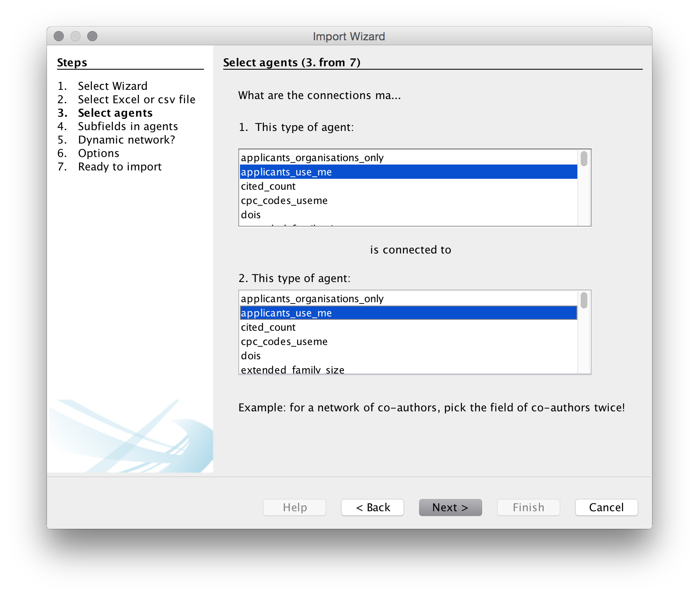
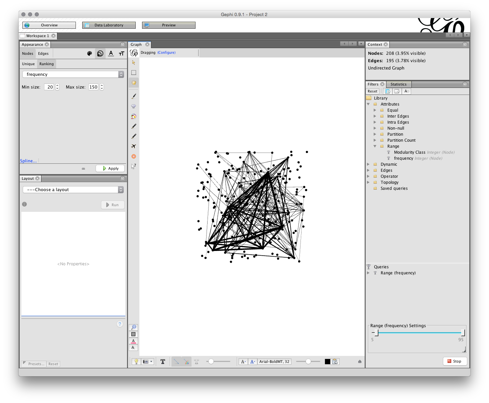

# Gephi

<!---update dataset links--->
This chapter focuses on visualising patent data in networks using the open source software [Gephi](http://gephi.github.io). Gephi is one of a growing number of free network analysis and visualisation tools with others including [Cytoscape](http://www.cytoscape.org), [Tulip](http://tulip.labri.fr/TulipDrupal/), [GraphViz](http://www.graphviz.org), [Pajek](http://mrvar.fdv.uni-lj.si/pajek/) for Windows, and [VOSviewer](http://www.vosviewer.com/Home) to name but a few. In addition, network visualisation packages are available for R and Python. We have chosen to focus on Gephi because it is a good all round network visualisation tool that is quite easy to use and to learn. 

In this chapter we will focus on creating a simple network visualisation of the relationship between patent applicants (assignees). However, network visualisation can be used to visualise a range of fields and relationships, such as inventors, key words, IPC and CPC codes, and citations among other options. 

For this chapter we will use a dataset on drones from the [Lens patent database](https://www.lens.org/lens/search?q=%22drone%22+OR+%22drones%22&predicate=%26%26&l=en). The dataset consists of 5884 patent documents containing the terms "drone or drones" in the full text deduplicated to individual families from the full publication set. The dataset has been extensively cleaned in Vantage Point by separating out applicant and inventor names and then using fuzzy logic matching to clean up names. Very very similar results can be achieved using Open Refine as described in Chapter 9 of this Manual. 

The dataset can be downloaded from Github in a zip file to unzip [here](https://github.com/wipo-analytics/drones_data/raw/master/use_me/gephi/gephi_drones_fulltext_cleaned_5884.csv.zip). 

## Installing Gephi

You should install gephi 9.1 (the latest release) rather than an earlier version. Note that any later updates may not contain the key functionality that is needed below (as it takes a while for some of the plugins and features to catch up). 

To install for your operating system follow these [instructions](https://gephi.org/users/download/)

After you have finished this chapter you may want to follow the [Quick start guide](https://gephi.github.io/tutorials/gephi-tutorial-quick_start.pdf) although we will cover those topics in the article. The [Learn section](http://gephi.github.io/users/) of the website provides additional tutorials. 

## Opening Gephi and Installing Plugins

When you have installed Gephi, open it and you should see the following welcome screen. 

Before we do anything else, we need to install a plugin developed by [Clement Levallois](http://www.em-lyon.com/en/faculty-research-education/faculty-research/international-business-school-professors/Permanent-Professors/Clement-LEVALLOIS) to convert Excel and csv files into gephi network files. To install the plugin select the `Tools` menu in the menu bar and then `Plugins`.

You will see a pop up menu for the plugins. At this point you may want to press `Reload Catalog` to make sure everything is loaded. Then head to `Available Plugins`. Click on `name` to sort them alphabetically. You now want to look for a plugin called `Convert Excel and csv files to networks`. Select the check box, press `Install` and follow through the menus. Just keep pressing at the prompts and then you will need to restart at the end. 

You will need to restart Gephi for it to take effect but if you return to the Plugins menu and then choose the installed tab you should see this.

You are good to go. While you are there you may want to check out the other plugins to get an idea of what is available. For more on the conversion plugin see this description [Excel/csv converter to network plugin](https://marketplace.gephi.org/plugin/excel-csv-converter-to-network/). 

## Importing a file to Gephi with the converter plugin

We will concentrate on using the `drones` patent dataset in the  zipped .csv version [here](https://github.com/wipo-analytics/drones_data/raw/master/use_me/gephi/gephi_drones_fulltext_cleaned_5884.csv.zip) and don't forget to unzip the file. While Gephi works with .csv files, the import plugin includes a timeline option that only works with Excel. For that reason we will use the Excel version.

### Step 1. Open Gephi and Choose File > Import

For this to work we need to use the `Import` function under the File menu. 

You should now see a menu like that below. Make sure that you choose the co-occurrence option.

Next you will be asked to select the file to use. We will download and then unzip the [gephi_drones_fulltext_cleaned_5884.csv](https://github.com/wipo-analytics/drones_data/raw/master/use_me/gephi/gephi_drones_fulltext_cleaned_5884.csv.zip) file that is located on the WIPO Analytics website on Git Hub.

When you have chosen `Data importer(co-occurrences)` then choose `Next`. Make sure the column headers stays selected (unless using your own data). You will then need to choose a delimiter. In this case it is a comma but in other cases it may be a semicolon or a tab. 

We now need to choose the agents, that is the actors or objects that we want to create a network map with. We will use `patent_assignees_cleaned` as this is a relatively small set. We will choose the same field in the two boxes because we are interested in co-occurrence analysis. 

In the next step we need to specify the delimiter for splitting the contents of the `applicants_use_me` column. In all the fields it is a semicolon so let's choose that. Note that if you are doing this with raw Lens data that you have not previously cleaned the Lens delimited is a double semi-colon (which is not helpful) and will need to be replaced prior to import.

We will then be asked if we want a dynamic network. This presently only works with Excel files and even then it does not always work well. We will leave this blank as we are using a .csv file. Note that if we were using an Excel file the choices we would use would normally be the publication year or publication date or the priority year or date for patent data. 

The next menu provides us with a list of options. Unfortunately, with one exception, it is not entirely clear what the consequences of these choices are so experimentation may be needed.

Choice1. Create links between `applicants_use_me`.
Choice 2. Remove duplicates. We don't need that as we know that they are unique.
Choice 3. Remove self-loops. Generally we do want this (otherwise known as removing the diagonal to prevent actors counting onto themselves - this will produce a large black hoop or handle for a self-loop in Gephi). 

We will choose to create the links and to remove the self loops. 

Next we will see a create network screen setting out our choices. 

Press Finish

Next we will see an import screen. 

It is quite common to see warning messages on this screen. 

In this case some of the applicants cells in the worksheet are blank because no data is available. When you see warning messages it is a good idea to check the underlying file to make sure that you understand the nature of the warning. 

A second common warning with dynamic networks is that the year field is not correctly formatted. In that case, check that the format of the date/year field is what gephi is expecting in the underlying data. You can review the data in the data laboratory. 

Note that the import screen also provides options on the type of graph. Normally for networks of authors, inventors and actors leave this as an undirected (unordered) network. Undirected is the basic default for patent data and scientific literature. We will also see the number of nodes (dots) and edges (connections). It is important to keep an eye on these values. If the nodes are much lower than you expect then it is useful to go back to your data and inspect for problems such as concatenation of cells and so on.

Click OK. You should now see a raw network that looks like this. 

Note that we can see the number of Nodes and Edges in the top right. If we switch to the top left, we will see three tabs, for `Overview`, `Data Laboratory` and `Preview`. Choose `Data Laboratory`. 

In the Data laboratory we can see the ID, Label, type of field and the frequency (the count of the number of times the name appears). Note that these fields are editable by clicking inside the entry and can also be grouped (for example where a variant of the same name has been missed during the name cleaning process in a tool such as Open Refine).

In some cases you may have filled any blank cells in the dataset with NA (for Not Available). If this is the case NA will show up as a node on the network. You can address this type of issue in the Data Laboratory by right clicking on the NA value and then Delete. Note also that you can always exclude or combine nodes after you have laid out the network by editing in the Data Laboratory. 

The second part of the Data Laboratory is the Edges under Data Table in the Data Laboratory. The edges table involves a source and a target, where the source is the source node and the target is another node where there is a link between the nodes. We can see the edges table sorted alphabetically (click the source heading to sort) where the value in weight is the number of shared records.

Again, note that it is possible to export the edges set and import a set. Also note the menus at the bottom of the screen which allow column values to be copied over. This can be useful where the label value is not populated meaning that a name will not display on the node when the graph is laid out.

Most of the time we can simply proceed with laying out the network without paying much attention to the data laboratory. However, it is important to become familiar with the data laboratory to avoid unexpected problems or to spot corruption in the data.

## Sizing and Colouring Nodes

When we look at the `Overview` screen we have quite a wide range of options. We will start on the upper right with the Statistics panel. 

The `Run` buttons will calculate a range of statistics on the network. Probably the two most useful are: 

1. Modularity Class. This algorithm iterates over the connections (edges) and allocates the nodes to communities or clusters based on the strength of the connections. This algorithm is explained in detail in this article [Vincent D Blondel, Jean-Loup Guillaume, Renaud Lambiotte, Etienne Lefebvre, Fast unfolding of communities in large networks, in Journal of Statistical Mechanics: Theory and Experiment 2008 (10), P1000](http://arxiv.org/abs/0803.0476). The ability to detect communities in networks based on the strength of connections is a powerful tool in patent analytics.
2. Network Diameter. This calculates two measures of `betweeness`, that is `betweeness centrality` (how often a node appears on the shortest path between nodes) and centrality(the average distance from a starting node to other nodes in the network). Network Diameter also calculates Eccentricity which is the distance between a given node and the farthest node from it in the network. For background on this see the Wikipedia entry and also [Ulrik Brandes, A Faster Algorithm for Betweenness Centrality, in Journal of Mathematical Sociology 25(2):163-177, (2001)](http://www.inf.uni-konstanz.de/algo/publications/b-fabc-01.pdf)

Whereas Modularity Class identifies communities (particularly in large networks), centrality measures examine the position of a node in the graph relative to other nodes. This can be useful for identifying key actors in networks based on the nature of their connections with other actors (rather than simply the number of records). 

If we run Modularity Class as in the figure a pop up message will inform us that there are 246 communities in the network. Given that there are only 362 nodes this suggests a weakly connected network made up of small individual clusters. 

###  Filtering the data

We have a total of 5,265 nodes which is quite dense. After running the modularity class algorithm above, we will now move over to the Filters tab next to Statistics. Our aim here is to reduce the size of the network

Move over to the left where it says Ranking and then select the red inverted triangle. Set the largest value to 200 and the smallest to 20 (it is up to you what you choose). Then apply. The network will now change. 

Open the Filters menu and choose Attributes. That will open a set of Folders and we would like to use Range. When the Range folder is open drag frequency into the Queries area below (marked with a red icon and Drag message when empty). Then either drag the range bar until you see a frequency of 5 as the minimum or change the number by clicking on it. Note that as we drag the results the number of Nodes and Edges in the Context above will change. We are looking for a manageable number. In the image below I have set the number to 5.

###  Setting Node Size

Next we want to size the nodes. On the left, look for the Appearance tab and then with Nodes in grey choose the Ranking button. Here the minimum size is set to 20 and the maximum to 150. Note that the default setting is 10 and this is generally too small for easy visibility. Press Apply and you will see the network changes to display the size of nodes based on the frequency. You can always adjust the size of nodes later if you are unhappy with them. 

###  Colouring the Nodes

To colour the nodes choose the small palette icon next to the size icon. We now have choices on Unique (simply grey), Partition or Ranking. In this case we will choose Ranking and frequency. Note that a range of colour palettes can be accessed by clicking on the small icon to the right of the colour bar under ranking. When you have found a palette that you like then click Apply.  

An alternative way of colouring the graph in earlier versions of gephi was to partition on Modularity class. This would colour the nodes as 'communities' of closely linked nodes. However, at present in Gephi 9 this option does not appear to be consistently available but may return in a future update. 

There are a range of other options for colouring nodes including a colour plugin that will detect if a column with a colour value is present in the imported data. This can be very useful if you have colour coded categories of data prior to importing to gephi.   

## Laying out the Graph

In the bottom left panel called Layout in the figure above there are a range of network visualisation options with more that can be imported from the plugin menus. Among the most useful are Fruchterman-Reingold, Force Atlas, OpenOrd and Circular with specialist plugins for georeferenced layouts that are well worth experimenting with. 

We will illustrate network layout using Fruchterman-Reingold. The first setting is the area for the graph. The default is 10,000 but we will start with 20,000 because 10,000 tends to be too crunched. The default for the gravity setting is 10. This is intended to stop the nodes dispersing too far but is often too tight when labels are applied. Try changing the setting to 5 (which reduces the gravitational pull). The settings in the different layout options can take some getting used too and it is worthwhile creating a record of useful settings. Gephi does not save your settings so make sure you write down useful settings. 

We are now good to go. But, before we start take note of two important options for later use. 

The first is the NoOverlap plugin we installed above. This will help us to deal with overlapping nodes after layout. The second is Expansion which will help us to increase the size of a network are to make it easier to see the labels. Note also the Contraction option which will allow us to pull a network back in if it expands too far. 

Now make sure that Fruchterman-Reingold is selected with the settings mentioned above and click `Run`. 

You can leave the network to run and the nodes will start to settle. If the network disappears from view (depending on your mouse) try scrolling to zoom out. Our aim is to arrive at a situation where lines only cross through nodes where they are connected. As you become more experienced with layout you may want to assist the nodes with moving into a clear position for a tidier graph. 

You will now have a network that looks something like this (note that 15,000 for the Area may have been enough). 

We can see that some of the nodes are set very close together. That will affect the ability to label the nodes in a clear way. To address this we first use the NoOverlap function and later we may want to use the Expansion function in the Layout drop down menu items. 

Choose nooverlap from the menu and Run. 

While the difference is very minor in this case we have at least moved the nodes into separate positions. At a later stage you may want to use the Expansion function. This will increase the size of the network and is useful when working with labels. 

### Save your work

At this stage we will save our work. One feature of Gephi as a Java programme is that there is no undo option. As a result it is a good idea to save work at a point where you are fairly happy with the layout as it stands. 

Go to File and choose Save As and give the file name a `.gephi` extension. Do not forget to do this or gephi will not know how to read the file. If all goes well the file will save. On some occasions Java may throw an exception and you will basically have to start again. That is one reason to save work in Gephi regularly because it is a beta programme and subject to the predilections of Java on your computer. 

## Adding Labels

The next step is to add some labels. In the bottom menu bar there are a range of options. What we want is the small grey triangle on the right of this menu bar that will open up a new bar. Click in the triangle and you will see a set of options. Choose labels and then at the far left check the `Node` box. We will not see any labels yet. 

To the right is a menu with size. This is set to scaled. To see some labels move the scale slider as far as it will go. We will see labels come into view and a first hint that we will need to do some more work on laying out the graph to make it readable. 

Next, change size to Node Size, the screen will now fill with text. Go to the scaler and pull it back until there is something more or less readable.

At this stage we may need to take a couple of actions. 

1. Where it is clear that our nodes are too close together we will need to run Expansion from the layout menu. As a general rule of thumb you should only need to do this twice at most... but it may depend on your graph. 
2. If you have very long labels such as Massachusetts Institute of Technology you will probably want to head over to the Observatory and edit the Node Label to something manageable such as MIT. This can make a big difference in cleaning up the labels. 

In the image below we have used Expansion twice and then manually resize the labels using the slider. 

You will now have something that looks more or less like this. 

Note that you can use the slider to the right in the bottom menu to adjust the sizes and you could of course adjust the font. In some cases you may be happy with a rough and ready network rather than the detailed adjustments that are required for a final network graph. 

Note the small camera icon on the left of the bottom menu. Either press that to take a screenshot or hold to bring up a configure menu that will allow you to choose a size. 

If you pursuing this option you may also want to adjust the font or the colour and to use the bottom menu to arrive at a result you are happy with for display. In some cases (as we will deal with below) manually moving the nodes will allow you to arrive at a cleaner network for a screenshot. 

Screenshots can be a very useful step in exploring data or sharing data internally. For publication quality graphics you will need to move over to using the Preview Options and engage in the `gephi shuffle` to progressively clean up the network for a publication quality graphic. 

## Using the Preview Options

A more involved option for network visualisation is to move over to the Preview tab next to the Data Laboratory. 

The default option uses curved edges. To use this press `Refresh`. This is fine but we can't see any labels. In the presets now try default curved. You can play around with the different settings until you find a version that you like. 

The main issue that we have here is that the labels are too large and the line weigths may also be very heavy.

To address the line weigth look for and check the rescale weight option under edges. 

Note here the difference with the visualisation in the Overview. With Gephi what you see is not what you get. 

To arrive at a more readable network the first option is to adjust the size of the font in the `Node Labels` panel of the preview settings. Note here that label size is set to be proportional to the font (uncheck that and experiment if you wish). If we stick with proportional font size then we will start smaller and move upwards. For example, if we adjust the font size to 3 then the proportional font size will be reduced. In deciding on the font size an important consideration will be how many nodes you want to be legible to the reader. In this case setting the font size to 3 and this produces a pretty legible network.

That is quite an acceptable graph for seeing the larger nodes. However, note that the labels of some of the nodes are overlapping some of the other nodes. This can produce a very cluttered look. The larger the base font size the more cluttered the graph will look and the more adjustment it is likely to need. 

To make adjustments to this network we will use size 3. We will now need to move back and forwards between the Preview and the Overview adjusting the position of the nodes. For very complex graphs it can help to print out the preview to see what you need to adjust. Another sensible way to proceed is to mentally divide the graph into quarters and proceed clockwise quarter by quarter adjusting the nodes as you go. It is a very good idea to save your work at this point and as you go along. 

In the first and second quarter moving clockwise things look good with no overlapping labels. However, some adjustments are needed in the third quarter in the middle of the network where Campanella and Kurs are overlapping. To make the adjustment move to the Overview tab, then select the small hand in the left vertical menu for grab. Locate Campanella and move it out of the way so it is not overlapping. Be gentle. Now go back to Preview and hit Refresh. When doing this quarter by quarter it can be helpful to zoom in in the Overview and in the Preview. For each of the overlapping nodes quarter by quarter make an adjustment periodically checking back by using Refresh in Preview and saving as you go along. Note that the aim is minor adjustments rather than major adjustments to node position (it is also possible to attempt to use Label Adjust in the Layout options but in practice this can distort the network). In the process it is also worth watching out for edges that intersect with nodes where there is no actual link. In those cases adjust the node position by trying to move it to the side of the unrelated edge. Note that this is often not possible with complex graphs and you will need to explain in the text that nodes may intersect with unrelated edges. Also check that any edits to labels do not contain mistakes (such as CATECH rather than CALTECH) and adjust accordingly. Typically long labels cause problems at this point and can be edited down in the Data Laboratory. 

Through a series of minor adjustments in a clockwise direction you should arrive at a final network graph. Expect to spend about 20 minutes on clean up when you are familiar with Gephi depending on the number of nodes. It is worth noting that you will often need to go back to make final adjustments. 

The basic principle here is that each node should have a readable label when you zoom in and that edges should not intersect with unrelated nodes (except if this is unavoidable). In this case we have taken a screen shot of the core of the network.

It is quite common when you arrive at a publication quality graphic to suddenly discover a mistake in the network. For example, at the data cleaning stage you may have decided not to group two companies with very similar names. However, at the network visualization stage the network suggests that in practice the two companies are one and the same. In this case check the data and head over to the Data Laboratory to group the nodes to a single node. As this suggests, time spent on data cleaning and data preparation will normally reap dividends in terms of time saved later in the analysis and visualization process. 

## Exporting from Preview

At this stage we will want to do a final check and then export the data. Arriving at a publication quality export can in fact be the most time consuming and troublesome aspect of using Gephi. Before going any further save your work.

When exporting note that what you see on the screen and what you get are not exactly the same thing. The main issues are borders around nodes and the weight of lines in the edges. To adjust for this in the Nodes panel in Preview change the border width to a lower setting or 0 (the option we are choosing here). In the edges panel, if you do not want heavy lines then adjust the thickness or opacity (or both). In this case we have reduced the opacity of the edges to 50 and left the thickness as is. If you change something remember to hit Refresh.

Next select the export button in the bottom left. We will export to .pdf. 

When you choose Export note that there is an `Options` menu for tighter control of the export. 

The defaults are sensible and we will use those. If you are tempted to adjust them note that Gephi does not remember your settings, even when saved, so write them down. In reality the defaults work very well. 

If all goes well you will end up with an image that looks like this. 

Because the default size is portrait you will want to crop the image. For publication you will also want to outline the text (to fix the font across system). This can be done with the free GIMP software or paid software such as Adobe Illustrator. 

Congratulations, you have now created your first Gephi network graph. 

## Resources

1.  [Gephi website](http://gephi.github.io/)
2. [Gephi github repository](https://github.com/gephi/gephi)
3.  Quick start [guide](https://gephi.github.io/tutorials/gephi-tutorial-quick_start.pdf)
4.  Installation instructions for [All platforms](http://gephi.github.io/users/install/).
Gephi 8 suffers from a known issue for Mac users. That is, it uses Java 6 which is not installed by default on Macs. To resolve this you should follow the instructions posted [here](http://sumnous.github.io/blog/2014/07/24/gephi-on-mac/) and works very well in most cases. It basically involves downloading a mac version of Java containing Java 6 and then running three or four commands in the Terminal on the mac to configure Gephi. If that doesn't work try this more [detailed account](https://lbartkowski.wordpress.com/2014/11/28/gephi-0-8-2-on-apple-osx-yosemite/). 
5.  [Excel/csv converter to network plugin](https://marketplace.gephi.org/plugin/excel-csv-converter-to-network/)
6. For ideas on patent network visualisation you might want to try this article on [synthetic biology](http://journals.plos.org/plosone/article?id=10.1371/journal.pone.0034368), this [article](http://journals.plos.org/plosone/article?id=10.1371/journal.pone.0078737) on species names in patent data, and the use of exploratory network analysis using IPC/CPC co-occurrence analysis in the [WIPO Patent Landscape for Animal Genetic Resources](http://www.wipo.int/patentscope/en/programs/patent_landscapes/reports/animal_gr.html). For more try this [Google Search](https://www.google.co.uk/webhp?sourceid=chrome-instant&ion=1&espv=2&ie=UTF-8#q=patent%20network%20analysis).
