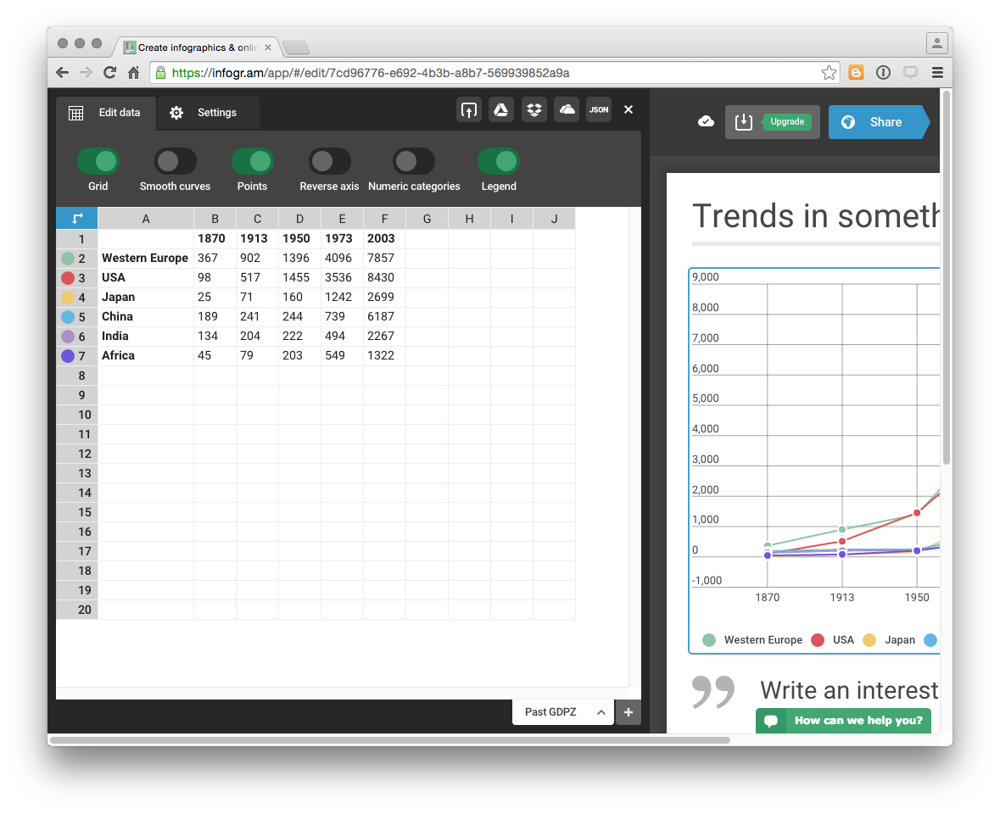

# Patent Infographics with R

```{r global_options, include=FALSE}
knitr::opts_chunk$set(cache=TRUE, tidy=TRUE, fig.width=12, fig.height=8, fig.align = "center", echo=TRUE, warning=FALSE, message=FALSE)
```

In this chapter we will use RStudio to prepare patent data for visualisation in an infographic using online software tools.  

Infographics are a popular way of presenting data in a way that is easy for a reader to understand without reading a long report. Infographics are well suited to presenting summaries of data with simple messages about key findings. A good infographic can encourage the audience to read a detailed report and is a tool for engagement with audiences during presentations of the findings of patent research. 

Some patent offices have already been creating infographics as part of their reports to policy makers and other clients. The Instituto Nacional de Propiedade Industrial (INPI) in Brazil produces regular two page [Technology Radar](http://www.inpi.gov.br/menu-servicos/informacao/radares-tecnologicos) (Radar Tecnologico) consisting of charts and maps that briefly summarise more detailed research on subjects such as [Nanotechnology in Waste Management](http://www.inpi.gov.br/menu-servicos/arquivos-cedin/n08_radar_tecnologico_nano_residuos_versao_resumida_ingles_atualizada_20160122.pdf). [WIPO Patent Landscape Reports](http://www.wipo.int/patentscope/en/programs/patent_landscapes/), which go into depth on patent activity for a particular area, are accompanied by one page infographics that have proved very popular such as the infographic accompanying a recent report on [assistive devices](http://www.wipo.int/export/sites/www/patentscope/en/programs/patent_landscapes/reports/documents/assistivedevices_infographic.pdf). 

A growing number of companies are offering online infographic software services such as [infogr.am](https://infogr.am/app/#/library),[easel.ly](http://www.easel.ly) [piktochart.com](https://magic.piktochart.com/templates), [canva.com](https://www.canva.com/create/infographics/) or [venngage.com](https://venngage.com) to mention only a selection of the offerings out there. The [Cool Infographics website](http://www.coolinfographics.com/tools/) provides a useful overview of available tools. 

One feature of many of these services is that they are based on a freemium model. Creating graphics is free but the ability to export files and the available formats for export of your masterpiece (e.g. high resolution or .pdf) often depend on upgrading to a monthly account at varying prices. In this chapter we test drive [infogr.am](https://infogr.am/app/#/library) as a chart friendly service, albeit with export options that depend on a paid account. 

This chapter is divided into two sections. 

1. In part 1 we focus on using RStudio to prepare patent data for visualisation in infographics software using the `dplyr`, `tidyr` and `stringr` packages. This involves dealing with common problems with patent data such as concatenated fields, white space and creating counts of data fields.
2. In part 2 we produce an infographic from the data using [infogr.am](https://infogr.am/app/#/library).

## Getting Started

To start with we need to ensure that RStudio and R for your operating system are installed by following the instructions on the RStudio website [here](https://www.rstudio.com/products/rstudio/download/). Do not forget to follow the link to also [install R for your operating system](https://cran.rstudio.com).

When working in RStudio it is good practice to work with projects. This will keep all of the files for a project in the same folder. To create a project go to File, New Project and create a project. Call the project something like infographic. Any file you create and save for the project will now be listed under the Files tab in RStudio. 

R works using packages (libraries) and there are around 7,490 of them for a whole range of purposes. We will use just a few of them. To install a package we use the following. Copy and paste the code into the Console and press enter.  

```{r install_tidyverse, eval=FALSE}
install.packages("tidyverse") # the group of packages you will need
```

Packages can also be installed by selecting the Packages tab and typing the name of the package. 

To load the packages (libraries) use the following or check the tick box in the Packages pane. 
 
```{r libraries, eval=FALSE, warning=FALSE}
library(readr) 
library(dplyr) 
library(tidyr) 
library(stringr)
library(ggplot2)
```

We are now ready to go. 

## Load a .csv file using `readr`

We will work with the `pizza_medium_clean` dataset in the online [Github Manual repository](https://github.com/wipo-analytics/opensource-patent-analytics/tree/master/2_datasets). If manually downloading a file remember to click on the file name and select `Raw` to download the actual file. 

We can use the easy to use `read_csv()` function from the `readr` package to quickly read in our pizza data directly from the Github repository. Note the `raw` at the beginning of the filename. 

```{r read}
library(readr)
pizza <- read_csv("https://github.com/wipo-analytics/opensource-patent-analytics/blob/master/2_datasets/pizza_medium_clean/pizza.csv?raw=true")
```

`readr` will display a warning for the file arising from its efforts to parse publication dates on import. We will ignore this as we will not be using this field.

As an alternative to importing directly from Github download the file and in RStudio use `File > Import Dataset > From .csv`. If you experience problems with direct import of a file the File > Import Dataset approach will give you a range of easy to use controls for figuring this out (e.g. where .csv is actually a tab separated file).

## Viewing Data

We can view data in a variety of ways. 

1. In the console:

```{r viewinconsole}
pizza
```

2. In Environment click on the blue arrow to see in the environment. Keep clicking to open a new window with the data. 

3. Use the `View()` command (for data.frames and tables)

```{r View, eval=FALSE}
View(pizza)
```

If possible use the View() command or environment. The difficulty with the console is that large amounts of data will simply stream past. 

## Identifying Types of Object

We often want to know what type of object we are working with and more details about the object so we know what to do later. Here are some of the most common commands for obtaining information about objects.

```{r type, eval=FALSE}
class(pizza) ## type of object
names(pizza) ## names of variables
str(pizza) ## structure of object
dim(pizza) ## dimensions of the object
```

The most useful command in this list is `str()` because this allows us to access the structure of the object and see its type.

```{r strpizza, eval=FALSE}
str(pizza, max.level = 1)
```

`str()` is particularly useful because we can see the names of the fields (vectors) and their type. Most patent data is a character vector with dates forming integers. 

## Working with Data

We will often want to select aspects of our data to focus on a specific set of columns or to create a graph. We might also want to add information, notably numeric counts. 

The `dplyr` package provides a set of very handy functions for selecting, adding and counting data. The `tidyr` and `stringr` packages are sister packages that contain a range of other useful functions for working with our data. We have covered some of these in other chapters on graphing using R but will go through them quickly and then pull them together into a function that we can use across our dataset. 

### Select

In this case we will start by using the `select()` function to limit the data to specific columns. We can do this using their names or their numeric position (best for large number of columns e.g. 1:31). In `dplyr`, unlike most R packages, existing character columns do not require `""`.

```{r select}
library(dplyr)
pizza_number <- select(pizza, publication_number, publication_year)
```

We now have a new data.frame that contains two columns. One with the year and one with the publication number. Note that we have created a new object called pizza_number using `<-` and that after `select()` we have named our original data and the columns we want. A fundamental feature of select is that it will drop columns that we do not name. So it is best to create a new object using `<-` if you want to keep your original data for later work. 

### Adding data with `mutate()`

`mutate()` is a `dplyr` function that allows us to add data based on existing data in our data frame, for example to perform a calculation. In the case of patent data we normally lack a numeric field to use for counts. We can however assign a value to our publication field by using sum() and the number 1 as follows. 

```{r mutate}
library(dplyr)
pizza_number <- mutate(pizza_number, n = sum(publication_number = 1))
```

When we view `pizza_number` we now have a value of 1 in the column `n` for each publication number. Note that in patent data a priority, application, publication or family number may occur multiple times and we would want to reduce the dataset to distinct records. For that we would use `n_distinct(pizza_number$publication_number)` from `dplyr` or `unique(pizza_number$publication_number)` from base R. Because the publication numbers are unique we can proceed. 

### Counting data using `count()`

At the moment, we have multiple instances of the same year (where a patent publication occurs in that year). We now want to calculate how many of our documents were published in each year. To do that we will use the `dplyr` function `count()`. We will use the publication_year and add `wt = ` (for weight) with `n` as the value to count.   

```{r count}
library(dplyr)
pizza_total <- count(pizza_number, publication_year, wt = n) 
pizza_total
```

When we now examine pizza_total, we will see the publication year and a summed value for the records in that year. 

This raises the question of how we know that R has calculated the count correctly. We already know that there are 9996 records in the pizza dataset. To check our count is correct we can simply use sum and select the column we want to sum using `$`. 

```{r checksum}
library(dplyr)
sum(pizza_total$nn)
```

So, all is good and we can move on. The `$` sign is one of the main ways of subsetting to tell R that we want to work with a specific column (the others are "[" and "[[").

### Rename a field with `rename()`

Next we will use `rename()` from `dplyr` to rename the fields. Note that understanding which field require quote marks can take some effort. In this case renaming the character vector publication_year as "pubyear" requires quotes  while renaming the numeric vector "n" does not. 

```{r rename}
library(dplyr)
pizza_total <- rename(pizza_total, pubyear = publication_year, publications = nn) %>% print()
```

### Make a quickplot with `qplot()`

Using the `qplot()` function in `ggplot2` we can now draw a quick line graph. Note that qplot() is unusual in R because the data (pizza_total) appears after the coordinates. We will specify that we want a line using `geom =` (if geom is left out it will be a scatter plot). This will give us an idea of what our plot might look like in our infographic and actions we might want to take on the data.  

```{r qplot}
library(ggplot2)
qplot(x = pubyear, y = publications, data = pizza_total, geom = "line")
```

<!------>

The plot reveals a data cliff in recent years. This normally reflects a lack of data for the last 2-3 years as recent documents feed through the system en route to publication. 

It is a good idea to remove the data cliff by cutting the data 2-3 years prior to the present. In some cases two years is sufficient, but 3 years is a good rule of thumb. 

We also have long tail of data with limited data from 1940 until the late 1970s. Depending on our purposes with the analysis we might want to keep this data (for historical analysis) or to focus in on a more recent period. 

We will limit our data to specific values using the `dplyr` function `filter()`. 

### Filter data using `filter()`

In contrast with `select()` which works with columns, `filter()` in `dplyr` works with rows. In this case we need to filter on the values in the pubyear column. To remove the data prior to 1990 we will use the greater than or equal to operator `>=` on the pubyear column and we will use the less than or equal to `<=` operator on the values after 2012.

One strength of `filter()` in `dplyr` is that it is easy to filter on multiple values in the same expression (unlike the very similar filter function in base R). The use of `filter()` will also remove the 30 records where the year is recorded as NA (Not Available). We will write this file to disk using the simple `write_csv()` from `readr`. To use `write_csv()` we first name our data (`pizza_total`) and then provide a file name with a .csv extension. In this case and other examples below we have used a descriptive file name bearing in mind that Windows systems have limitations on the length and type of characters that can be used in file names. 

```{r pizza_total}
library(dplyr)
library(readr)
pizza_total <- filter(pizza_total, pubyear >= 1990, pubyear <= 2012)
write_csv(pizza_total, "pizza_total_1990_2012.csv")
pizza_total
```

When we print pizza_total to the console we will see that the data now covers the period 1990-2012. When using `filter()` on values in this way it is important to remember to apply this filter to any subsequent operations on the data (such as applicants) so that it matches the same data period.

To see our .csv file we can head over to the Files tab and, assuming that we have created a project, the file will now appear in the list of project files. Clicking on the file name will display the raw unformatted data in RStudio. 

## Simplify code with pipes `%>%`

So far we have handled the code one line at a time. But, one of the great strengths of using a programming language is that we can run multiple lines of code together. There are two basic ways that we can do this. 

We will create a new temporary object `df` to demonstrate this. 

1. The standard way

```{r standard, eval=FALSE}
library(dplyr)
library(ggplot2)
df <- select(pizza, publication_number, publication_year)
df <- mutate(df, n = sum(publication_number = 1))
df <- count(df, publication_year, wt = n)
df <- rename(df, "pubyear" = publication_year, publications = nn)
df <- filter(df, pubyear >= 1990, pubyear <= 2012) 
qplot(x = pubyear, y = publications, data = df, geom = "line")
```

The code we have just created is six lines long. If we select all of this code and run it in one go it will produce our graph. 

One feature of this code is that each time we run a function on the object total we name it at the start of each function (e.g. mutate(df...)) and then we overwrite the object. 

We can save quite a lot of typing and reduce the complexity of the code using the pipe operator introduced by the the `magrittr` package and then adopted in Hadley Wickham's data wrangling and tidying packages. 

2. Using pipes `%>%`

Pipes are now a very popular way of writing R code because they simplify writing R code and speed it up. The most popular pipe is `%>%` which means "this" then "that". In this case we are going to create a new temporary object `df1` by first applying select to pizza, then mutate, count, rename and filter. Note that we only name our dataset once (in `select()`) and we do not need to keep overwriting the object. 

```{r piped}
library(dplyr)
library(ggplot2)
df1 <- 
  select(pizza, publication_number, publication_year) %>%
  mutate(n = sum(publication_number = 1)) %>%
  count(publication_year, wt = n) %>%
  rename("pubyear" = publication_year, publications = nn) %>%
  filter(pubyear >= 1990, pubyear <= 2012) %>%
  qplot(x = pubyear, y = publications, data = ., geom = "line") %>%
  print()
```

<!------>

In the standard code we typed `df` nine times to arrive at the same result. Using pipes we typed df1 once. Of greater importance is that the use of pipes simplifies the structure of R code by introducing a basic "this" then "that" logic which makes it easier to understand.

One point to note about this code is that `qplot()` requires us to name our data (in this case `df1`). However, `df1` is actually the final output of the code and does not exist as an input object before the final line is run. So, if we attempt to use `data = df1` in `qplot()` we will receive an error message. The way around this is to use `.` in place of our data object. That way `qplot()` will know we want to graph the outputs of the earlier code. Finally, we need to add an explicit call to `print()` to display the graph (without this the code will work but we will not see the graph).

If we now inspect the structure of the df1 object (using `str(df1)`) in the console, it will be a list. The reason for this is that it is an object with mixed components, including a data.frame with our data plus additional data setting out the contents of the plot. As there is no direct link between R and our infographics software this will create problems for us later because the infographics software won't know how to interpret the list object. So, it is generally a good idea to use a straight data.frame by excluding the call to `qplot` and adding it later when needed as follows.  

```{r df2}
library(dplyr)
library(ggplot2)
df2 <- 
  select(pizza, publication_number, publication_year) %>%
  mutate(n = sum(publication_number = 1)) %>%
  count(publication_year, wt = n) %>%
  rename("pubyear" = publication_year, publications = nn) %>%
  filter(pubyear >= 1990, pubyear <= 2012) %>%
  print()
```

Note that in this case the only change is that we need to explicitly include the reference to the df2 data frame as the data argument in the call to `qplot()`.

```{r df2_qplot}
library(ggplot2)
qplot(x = pubyear, y = publications, data = df2, geom = "line")
```

## Harmonising data

One challenge with creating multiple tables from a baseline dataset is keeping track of subdatasets. At the moment we have two basic objects we will be working with: 

1. `pizza` - our raw dataset
2. `pizza_total` - created via `pizza_number` limited to 1990_2012.

In the remainder of the chapter we will want to create some additional datasets from our pizza dataset. These are:

1. Country trends
2. Applicants
3. International Patent Classification (IPC) Class
4. Phrases
5. Google
6. Google IPC
7. Google phrases

We need to make sure that any data that we generate from our raw dataset matches the period for the `pizza_total` dataset. If we do not do this there is a risk that we will generate subdatasets with counts for the raw pizza dataset. 

To handle this we will use `filter()` to create a new baseline dataset with an unambiguous name.

```{r limited}
library(dplyr)
pizza_1990_2012 <- rename(pizza, "pubyear" = publication_year) %>%
  filter(pubyear >= 1990, pubyear <= 2012)
pizza_1990_2012
```

In this case we start with a call to `rename()` to make this consistent with our pizza_total table and then use a pipe to filter the data on the year. Note here that when filtering raw data on a set of values it is important to inspect it first to check that the field is clean (e.g. not concatenated). If for some reason your data is concatenated (which happens quite a lot with patent data) then lookup `?tidyr::separate_rows`. 

We are now in a position to create our country trends table.

## Country Trends using `spread()`

There are two basic data formats: long and wide. Our pizza dataset is in long format because each column is a variable (e.g. `publication_country`) and each row in `publication_country` contains a country name. This is the most common and useful data format. 

However, in some cases, such as `infogr.am` our visualisation software will expect the data to be in wide format. In this case each country name would become a variable (column name) with the years forming the rows and the number of records per year the observations. The key to this is the `tidyr()` function `spread()`. 

As above we will start off by using `select()` to create a table with the fields that we want. We will then use `mutate()` to add a numeric field and then count up that data. To illustrate the process run this code (we will not create an object). 

```{r demo}
library(dplyr)
select(pizza_1990_2012, publication_country_name, publication_number, pubyear) %>%
  mutate(n = sum(publication_number = 1)) %>% 
  count(publication_country_name, pubyear, wt = n) %>% 
  print()
```

When we run this code we will see the results in long format. We now want to take our `publication_country_name` column and spread it to form columns with `nn` as the values. 

In using spread note that it takes a data argument (`pizza_1990_2012`), a key (`publication_country_name`), and value column (`nn`) (created from `count()`). We are using pipes so the data only needs to be named in the first line. For additional arguments see `?spread()`. 

```{r country_totals}
library(dplyr)
library(tidyr)
country_totals <- select(pizza_1990_2012, publication_country_name, publication_number, pubyear) %>%
  mutate(n = sum(publication_number = 1)) %>% 
  count(publication_country_name, pubyear, wt = n) %>% # note n
  spread(publication_country_name, nn) # note double nn
country_totals
```

We now have data in wide format. 

In some cases, such as infogr.am, visualisation software may expect the country names to be the name of rows and the column names to be years . We can modify our call to `spread()` by replacing the `publication_country_name` with `pubyear`. Then we will write the data to disk for use in our infographic.  

```{r write_country_totals}
library(dplyr)
library(readr)
country_totals <- select(pizza_1990_2012, publication_country_name, publication_number, pubyear) %>%
  mutate(n = sum(publication_number = 1)) %>% 
  count(publication_country_name, pubyear, wt = n) %>% # note n
  spread(pubyear, nn) # note nn
country_totals
write_csv(country_totals, "pizza_country_1990_2012.csv")
```

To restore the data to long format we would need to use `gather()` as the counterpart to `spread()`. `gather()` takes a dataset, a key for the name of the column we want to gather the countries into, a value for the numeric count (in this case n), and finally the positions of the columns to gather in.  Note here that we need to look up the column positions in `country_totals` (e.g. using `View()`) or count the columns using `ncol(country_totals)`.

```{r gathering country totals}
library(dplyr)
gather(country_totals, year, n, 2:24) %>%
  print()
```

The combination of spread and gather work really well to prepare data in formats that are expected by other software. However, one of the main issues we encounter with patent data is that our data is not tidy because various fields are concatenated.  

## Tidying data - Separating and Gathering

In patent data we often see concatenated fields with a separator (normally a `;`). These are typically applicant names, inventor names, International Patent Classification (IPC) codes, or document numbers (priority numbers, family numbers). We need to `tidy` this data prior to data cleaning (such as cleaning names) or to prepare for analysis and visualisation. For more on the concept of tidy data read [Hadley Wickham's Tidy Data article](http://vita.had.co.nz/papers/tidy-data.pdf). The new [R for Data Science book](http://r4ds.had.co.nz/tidy-data.html) by Garrett Grolemund and Hadley Wickham (see Chapter 12) is also strongly recommended. 

To tidy patent data we will typically need to do two things. 

1. Separate the data so that each cell contains a unique data point (e.g. a name, code or publication number). This normally involves separating data into columns.

2. Gathering the data back in. This involves transforming the data in the columns we have created into rows. 

Separating data into columns is very easy in tools such as Excel. However, gathering the data back into separate rows is remarkably difficult. Happily, this is very easy to do in R with the `tidyr` package.

The `tidyr` package contains three functions that are very useful when working with patent data. When dealing with concatenated fields in columns the key function is `separate_rows`. 

Here we will work with the `applicants_cleaned` field in the pizza dataset. This field contains concatenated names with a `;` as the separator. For example, on lines 1_9 there are single applicant names or NA values. However, on lines 10 and line 59 we see:

```{r examplenames, eval=FALSE}
Ehrno Flexible A/S; Stergaard, Ole
Farrell Brian; Mcnulty John; Vishoot Lisa
```

The problem here is that when we are dealing with thousands of lines of applicant names we don't know how many names might be concatenated into each cell as a basis for separating the data into columns. Once we had split the columns (for example using Text to Columns in Excel) we would then need to work out how to gather the columns into rows. The `separate_rows()` function from `tidyr` makes light work of this problem. To use the function we name the dataset, the column we want to separate into rows and the separator (sep).

```{r pizza1}
library(dplyr)
library(tidyr)
pizza1 <- separate_rows(pizza_1990_2012, applicants_cleaned, sep = ";")
pizza1
```

Our original dataset contained 8,262 rows. Our new dataset split on applicant names contains 12,729 rows. The function has moved our target column from column 1 to column 31 in the data frame. We can easily move it back to inspect. 

```{r}
library(dplyr)
pizza1 <- select(pizza1, 31, 1:30)
```

`separate_rows()` has done a great job but one of the problems with concatenated names is extra white space around the separator. We will deal with this next.

### Trimming with `stringr`

If we inspect the bottom of the column by subsetting into it using `$` we will see that a lot of the names have a leading whitespace space. This results from the separate exercise where the `;` is actually `;space`. Take a look at the last few rows of the data using `tail()`. 

```{r tail}
tail(pizza1$applicants_cleaned, 20)
```

This is a big issue because any counts that we make later on using the applicants_cleaned field will treat "Oppenheimer Alan A" and " Oppenheimer Alan A" as separate names when they should be grouped together. 

We can address this in a couple of ways. One approach is to recognise that actually our separator is not a simple `";"` but `";space"` in our call to `separate_rows()`. In that case the call to `separate_rows()` would actually be `sep = "; "`. We will add a line of code to illustrate the impact of this change.

```{r}
tmp <- separate_rows(pizza_1990_2012, applicants_cleaned, sep = "; ")
tail(tmp$applicants_cleaned, 20)
```

Another way to address this, is to use the `str_trim()` function from the `stringr` package.

We can address this problem using a function from the `stringr` package `str_trim()`. We have a choice with `str_trim()` on whether to trim the whitespace on the right, left or both. Here we will choose both. 

Because we are seeking to modify an existing column (not to create a new vector or data.frame) we will use `$` to select the column and as the data for the `str_trim()` function. That will apply the function to the applicants column in pizza1. 

```{r str_trim}
library(stringr)
pizza1$applicants_cleaned <- str_trim(pizza1$applicants_cleaned, side = "both")
tail(pizza1$applicants_cleaned, 20)
```

Note that when using `str_trim()` we use subsetting to modify the applicants column in place. There is possibly a more efficient way of doing this with pipes but this appears difficult because the data.frame needs to exist for `str_trim()` to act on in place or we end up with a vector of applicant names rather than a data.frame. A solution to this problem is provided on Stack Overflow^[http://stackoverflow.com/questions/25975827/how-to-feed-the-result-of-a-pipe-chain-magrittr-to-an-object].

In practice, the most efficient solution in this case is to recognise that the separator for `separate_rows` is `";space"`. However, that will not always be true making the tools in `stringr` invaluable. To learn more about string manipulation in R try [Chapter 14 of R for Data Science by Garrett Grolemund and Hadley Wickham](http://r4ds.had.co.nz/strings.html).

We can tie the steps so far together using pipes into the following simpler code that we will become the applicants table for use in the infographic. We will add a call to rename and rename applicants_cleaned to tidy up. 

```{r tie_steps}
library(dplyr)
library(tidyr)
library(stringr)
applicants <- rename(pizza, "pubyear" = publication_year) %>%
  filter(pubyear >= 1990, pubyear <= 2012) %>%
  separate_rows(applicants_cleaned, sep = "; ") %>% 
  rename(applicants = applicants_cleaned) %>% 
  select(31, 1:30) # moves separated column to the beginning
applicants
```

We will want to create a plot with the applicants data in our infographic software. For that we need to introduce a field to count on. We might also want to establish a cut off point based on the number of records per applicant. 

In this code we will simply print the applicants ranked in descending order. The second to last line of the code provides a filter on the number of records. This value can be changed after inspecting the data. The final line omits NA values (otherwise the top result) where an applicant name is not available. 

```{r applicant_count}
library(tidyr)
library(dplyr)
applicant_count <- select(applicants, applicants, publication_number) %>%
  mutate(n = sum(publication_number = 1)) %>%
  count(applicants, wt = n) %>%
  arrange(desc(nn)) %>%
  filter(nn >= 1) %>%
  na.omit()
applicant_count 
```

If we inspect applicant count using `View(applicant_count)` we have 6,178 rows. That is far too many to display in an infographic. So, next we will filter the data on the value for the top ten (54). Then we will write the data to a .csv file using the simple `write_csv()` from `readr`.

```{r applicant_count1}
library(dplyr)
library(tidyr)
library(readr)
applicant_count <- select(applicants, applicants, publication_number) %>%
  mutate(n = sum(publication_number = 1)) %>%
  count(applicants, wt = n) %>%
  arrange(desc(nn)) %>%
  filter(nn >= 54) %>% 
  na.omit()
applicant_count 
write_csv(applicant_count, "pizza_applicants_1990_2012.csv")
```

When we inspect `applicant_count` we will see that Graphic Packaging International is the top result with 154 results with Google ranking third with 123 results followed by Microsoft. This could suggest that Google and Microsoft are suddenly entering the market for online pizza sales or pizza making software or, as is more likely, that there are uses other uses of the word pizza in patent data that we are not aware of. 

As part of our infographic we will want to explore this intriguing result in more detail. We can do this by creating a subdataset for Google using `filter()`.

## Selecting applicants using `filter()`

As we saw above, while `select()` functions with columns, `filter()` from `dplyr` works with rows. Here we will filter the data to select the rows in the applicants column that contain Google Inc. and then write that to a .csv for use in our infographic. Note the use of double `==` and the quotes around "Google Inc". 

```{r google}
library(dplyr)
library(readr)
google <- filter(applicants, applicants == "Google Inc")
google
write_csv(google, "google_1990_2012.csv")
```

Note that the correct result for the period 1990 to 2012 for Google is 123 records from 191 records across the whole pizza dataset. The correct result will be achieved only where you use the filtered, separated and trimmed data we created in the applicants data frame.  

## Generating IPC Tables

In the next step we will want to generate two tables containing International Patent Classification (IPC) data. IPC codes and the Cooperative Patent Classification (CPC, not present in this dataset) provide information on the technologies involved in a patent document. The IPC is hierarchical and proceeds from the general class level to the detailed group and subgroup level. Experience reveals that the majority of patent documents receive more than one IPC code to more fully describe the technological aspects of patent documents.

The pizza dataset contains IPC codes on the class and the subclass level in concatenated fields. One important consideration in using IPC data is that the descriptions are long and can be difficult for non-specialists to grasp. This can make visualising the data difficult and often requires manual efforts to edit labels for display.

We now want to generate three IPC tables. 

1. A general IPC table for the pizza dataset
2. A general IPC table for the Google dataset
3. A more detailed IPC subclass table for the Google dataset

For ease of presentation in an infographic we will use the `ipc_class` field. For many patent analytics purposes this will be too general. However it has the advantage of being easy to visualise. 

To generate the table we can use a generic function based on the code developed for dealing with the applicants data. We will call the function patent_count().

```{r generic_function}
patent_count <- function (data, col = "", count_col =  "", n_results = n_results, sep = "[^[:alnum:]]+") 
{
  p_count <- dplyr::select_(data, col, count_col) %>%
    tidyr::separate_rows_(col, sep = sep) %>% 
    dplyr::mutate_(n = sum(count_col = 1)) %>% 
    dplyr::select(2:3) 
  p_count %>% dplyr::group_by_(col) %>%
    dplyr::tally() %>%
    dplyr::arrange(desc(nn)) %>%
    dplyr::rename(records = nn) %>% 
    dplyr::ungroup() %>% 
    na.omit() %>% 
    .[1:n_results, ]
}
```

The `patent_count()` function is based on the the code we developed for applicants. It contains variations to make it work as a function. The function takes four arguments:

1. col = the concatenated column that we want to split and gather back in
2. col_count = a column for generating counts (in this dataset the publication_number)
3. n_results = the number of results we want to see in the new table (typically 10 or 20 for visualisation). This is equivalent to the number of rows that you want to see. 
4. sep = the separator to use to separate the data in col. With patent data this is almost always "; " (as `;space`.

To generate the `ipc_class` data we can do the following and then write the file to .csv. Note that we have set the number of results `n_results` to 10. 

```{r pizza_class}
pizza_ipc_class <- patent_count(data = pizza_1990_2012, col = "ipc_class", count_col = "publication_number", n_results = 10, sep = ";")
pizza_ipc_class
write_csv(pizza_ipc_class, "pizza_ipcclass_1990_2012.csv")
```

Note that this dataset is based on the main `pizza_1990_2012` dataset (including cases where no applicant name is available). The reason we have not used the applicants dataset is because that dataset will duplicate the IPC field for each split of an applicant name. As a result it will over count the IPCs by the number of applicants on a document name. As this suggests, it is important to be careful when working with data that has been tidied because of the impact on other counts. 

This problem does not apply in the case of our Google data because the only applicant listed in that data is Google (excluding co-applicants). We can therefore safely use the Google dataset to identify the IPC codes. 

```{r google_class}
google_ipc_class <- patent_count(data = google, col = "ipc_class", count_col = "publication_number", n_results = 10, sep = ";")
google_ipc_class
write_csv(google_ipc_class, "google_ipcclass_1990_2012.csv")
```

There are only 7 classes and as we might expect they are dominated by computing. We might want to dig into this in a little more detail and so let's also create an IPC subclass field.

```{r google_subclass}
google_ipc_subclass <- patent_count(data = google, col = "ipc_subclass_detail", count_col = "publication_number", n_results = 10, sep = ";")
google_ipc_subclass
write_csv(google_ipc_subclass, "google_ipcsubclass_1990_2012.csv")
```

We now have the data on technology areas that we need to understand our data. The next and final step is to generate data from the text fields. 

### Phrases Tables

We will be using data from words and phrases in the titles of patent documents for use in a word cloud in our infographic. It is possible to generate this type of data in R directly using the `tm` and `NLP` packages. Our pizza dataset already contains a title field broken down into phrases using Vantagepoint software and so we will use that. We will use the field `title_nlp_multiword_phrases` as phrases are generally more informative than individual words. Once again we will use our general `patent_count()` function although experimentation may be needed to identify the number of phrases that visualise well in a word cloud. 

```{r pizza_phrases}
pizza_phrases <- patent_count(data = pizza_1990_2012, col = "title_nlp_multiword_phrases", count_col = "publication_number", n_results = 15, sep = ";")
pizza_phrases
write_csv(pizza_phrases, "pizza_phrases_1990_2012.csv")
```

Now we do the same with the Google data.

```{r google_phrases}
google_phrases <- patent_count(data = google, col = "title_nlp_multiword_phrases", count_col = "publication_number", n_results = 15, sep = ";")
google_phrases
write_csv(google_phrases, "google_phrases_1990_2012.csv")
```

We now have the following .csv files. 

1. `pizza_total_1990_2012`
2. `pizza_country_1990_2012`
3. `pizza_applicants_1990_2012`
4. `pizza_ipcclass_1990_2012`
5. `pizza_phrases_1990_2012`
6. `Google_1990_2012`
7. `Google_ipclass_1990_2012`
8. `Google_ipcsubclass_1990_2012`
9. `Google_phrases-1990_2012`

## Creating an infographic in infogr.am

If you are starting this chapter here then download the datasets we will be using as a single zip file from the Manual repository [here](https://github.com/wipo-analytics/opensource-patent-analytics/blob/master/2_datasets/infographic/infographic.zip?raw=true) and then unzip the file. 

We first need to sign up for a free account with [infogr.am](https://infogr.am/)


We will then see a page with some sample infographics to provide ideas to get you started. 


Click on one of the infograms with a graph such as Trends in Something and then click inside the graph box itself and select the edit button in the top right. 


This will open up a data panel with the toy data displayed. 



We want to replace this data by choosing the upload button and selecting our `pizza_country_1990_2012.csv` file. 


We now have a decent looking graph for our country trends data where we can see the number of records per country and year by hovering over the relevant data points. While some of the countries with low frequency data are crunched at the bottom (and would be better displayed in a separate graph), hovering over the data or over a country name will display the relevant country activity. We will therefore live with this. 

We now want to start adding story elements by clicking on the edit button in the title. Next we can start adding new boxes using the menu icons on the right. Here we have changed the title, added a simple body text for the data credit and then a quote from someone describing themselves as the Head of Pizza Analytics.


Next we need to start digging into the data using our IPC, applicants and phrases data. 

To work with our IPC class data we will add a bar chart and load the data. To do this select the graph icon in the right and then Bar. Once again we will choose edit and then load our `pizza_ipcclass_1990_2012` dataset. Then we can add a descriptive text box. We can then continue to add elements as follows:

1. applicants bar chart
2. pizza phrases by selecting graph and word cloud
3. Google ipc-subclass
4. Google word cloud. 

One useful approach to developing an infographic is to start by adding the images and then add titles and text boxes to raise key points. In infogram new text boxes appear below existing boxes but can be repositioned by dragging and dropping boxes onto each other. 

One nice feature of infogram is that it is easy to share the infographic with others through a url, an embed code or on facebook or via twitter. 

At the end of the infographic it is a good idea to provide a link where the reader can obtain more information, such as the full report or the underlying data. In this case we will add a link to the Tableau workbook on pizza patent activity that we developed in an earlier [chapter](https://public.tableau.com/profile/wipo.open.source.patent.analytics.manual#!/vizhome/pizzapatents/Overview). 

Our final infographic should look something like [this](https://infogr.am/trends_in_something).

### Round Up

In this chapter we have concentrated on using R to tidy patent data in order to create an online infographic using free software. Using our trusty pizza patent data from WIPO Patentscope we walked through the process of wrangling and tidying patent data first using short lines of code that we then combined into a reusable function. As this introduction to tidying data in R has hopefully revealed, R and packages such as `dplyr`, `tidyr` and `stringr` provide very useful tools for working with patent data, and they are free and well supported. 

In the final part of the chapter we used the data we had generated in RStudio to create an infographic using infogr.am that we then shared online. Infogram is just one of a number of online infographic services and it is well worth trying other services such as [easel.ly](https://www.easel.ly) to find a service that meets your needs. 

As regular users of R will already know, it is already possible to produce all of these graphics (such as word clouds) directly in R using tools such as `ggplot2`, `plotly` and word clouds using packages such as `wordcloud`. Some of these topics have been covered in other chapters and for more on text mining and word clouds in R see this recent article on [R-bloggers](http://www.r-bloggers.com/building-wordclouds-in-r/). None of the infographic services we viewed appeared to offer an API that would enable a direct connection with R. There also seems to be a gap in R's packages where infographics might sit with this [2015 R-bloggers article](http://www.r-bloggers.com/r-how-to-layout-and-design-an-infographic/) providing a walk through on how to create a basic infographic. 
