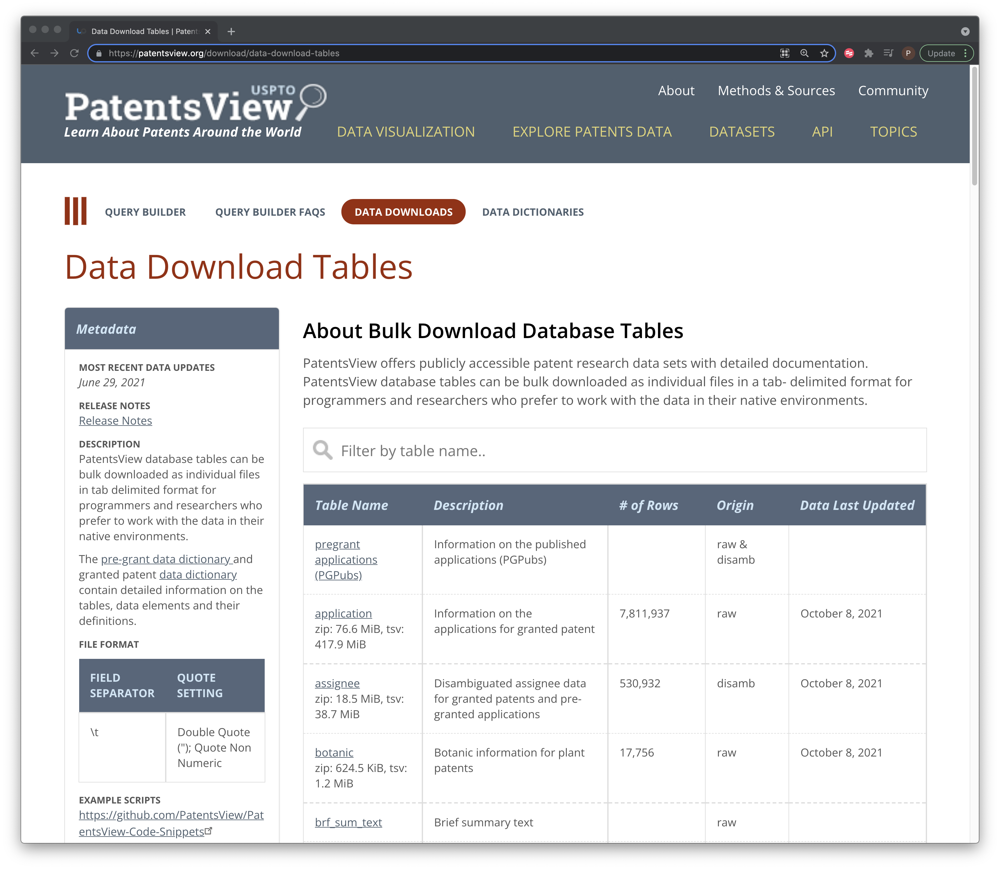
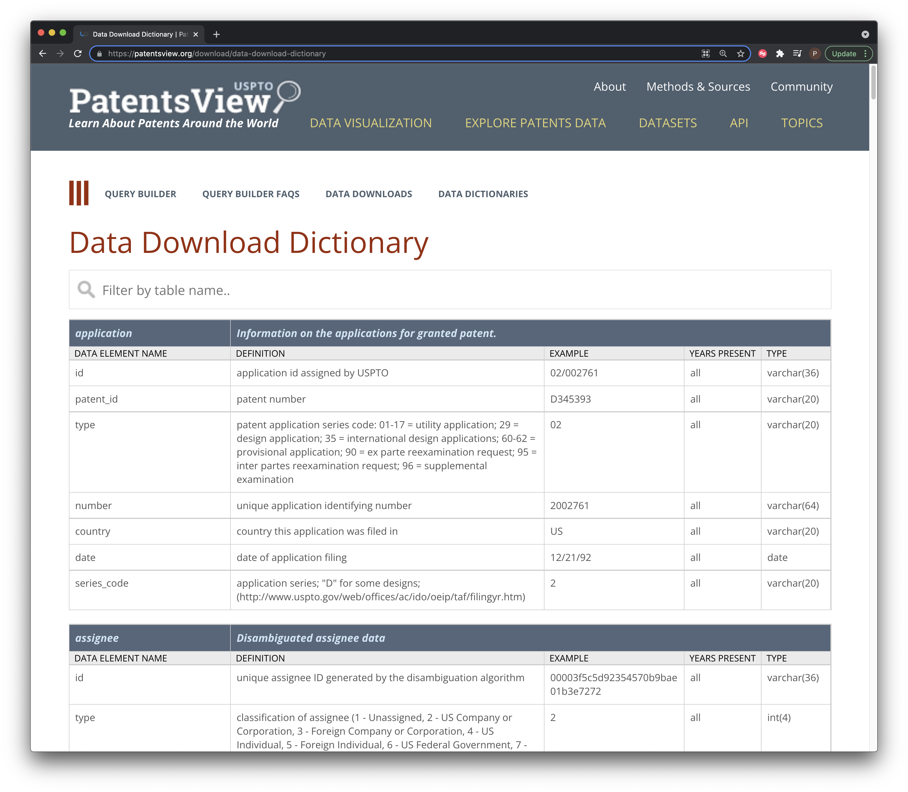

```{r setup, include=FALSE}
knitr::opts_chunk$set()
```

## Introduction

The US PatentsView service is a great innovation in making patent data available at scale. In a [previous article](INSERT) Enric Escorsa introduced the PattentsView API in R. In this article we are going to focus on the [PatentsView Data Download](https://patentsview.org/download/data-download-tables).

If you work with patent data a lot you may want to create your own internal database. Alternatively, if you are interested in text mining and machine learning you will probably want to access patent data at scale. The [PatentsView Data Download](https://patentsview.org/download/data-download-tables) makes it easy to do this. A lot of work has gone in to making the data available in table format so that it can be easily used by data scientists without a lot of messing around parsing masses of XML or JSON. It is difficult to over-emphasise how important this work has been because it takes away a huge amount of the pain involved in patent analytics at scale and provides us with very clean data formats to work with.

In this article we are going to focus on obtaining the information about the data that we want to download from PatentsView in an organised way using web scraping and data tidying in R to create two data tables. In part 2 we will use the results of this article to automate downloading the PatentsView bulk tables.

### The Data Download Page

In Figure \@ref(fig:downloads) we can see the download page. To the left we see a data dictionary link with details of the columns in each table and to the right we see the tables themselves.

```{r downloads, echo=FALSE, fig.align='center', fig.cap="The PatentsView Data Download Page"}


```

Before we get excited and start clicking to download the tables lets take a look at the data dictionary.

```{r dictionary, echo=FALSE, fig.align='center', fig.cap="The Granted Data Dictionary"}

```

What we notice here is a description of the content of each column data table along with examples and the data type. We need all this information if we are to construct PatentsView as a Postgres or other database or to use the data with Apache Spark. The data on ids provides the basis for joining different tables and the type is an important part of the database schema. However, notice that this is a html table and there is no excel or .csv version for download that we can see.

One approach to downloading all this data is to simply click on each link and download the file. However, there are a lot of tables and in reality this is only half of them. The tables we see in Figure \@ref(fig:downloads) are for *granted patents* and there is a separate page for [pre-grant publications of pgPubs](https://patentsview.org/download/pg-download-tables). So, we will be doing a lot of clicking of links if we want to obtain all this data. In addition, PatentsView is also subject to quite regular updates (every few months or so). So, if we want to keep the data up to date (and sooner or later we will want to do that) then we will have to click all these links all over again.

Another approach to downloading all this data is to write a small reusable script that will do this for us. However, to do that we need to perform some other tasks first.

1.  Investigate the [terms of use](https://patentsview.org/about/terms-privacy) to make sure that what we are about to do is OK;
2.  Identify the elements of the page containing the tables with links to the files to download;
3.  Download and reconstruct the table with the links;
4.  Download the files;
5.  Reconstruct the data dictionary for reference.

To do that we are going to use R, the `rvest` package and a helper gadget.

### Getting Set Up

You will need to follow the instructions for downloading RStudio and R for your system that you will find [here](https://www.rstudio.com/products/rstudio/download/). For this article we assume that you already have some familiarity with R but if not there are plenty of introductory tutorials out there. You can also just run each of the chunks in this article on your local machine and they should work.

Once you are up and running you need to install some packages. `rvest` is installed as part of the [tidyverse](https://www.tidyverse.org/packages/) suite of packages that are used for importing and wrangling data with R. `usethis`, `glue` and \`janitor\` are optional helper packages for this article but they are seriously useful and well worth becoming familiar with. `vroom` is used for rapidly importing large datasets in R and you will want to install this to make use of the R [import scripts](https://github.com/PatentsView/PatentsView-Code-Snippets/tree/master/03_bulk_download_read_in) from PatentsView later on.

```{r packages, eval=FALSE}
install.packages("tidyverse")
install.packages("usethis")
install.packages("glue")
install.packages("vroom")
install.packages("janitor")
```

If you are downloading the tidyverse for the first time this might be a good time for a cup of tea.

When the packages are installed we load them. Note that we need to include `rvest` in this list because it is downloaded along with the tidyverse but is not loaded when we call the `tidyverse`.

```{r libraries, eval=TRUE, message=FALSE, error=FALSE}

library(tidyverse)
library(rvest)
library(usethis)
library(glue)
library(vroom)
library(janitor)
```

We are going to be downloading the data download page and extracting the elements we are interested in. To help us figure out the elements that we want from the page we will use a small Google Chrome extension called [Selector Gadget](https://chrome.google.com/webstore/detail/selectorgadget/mhjhnkcfbdhnjickkkdbjoemdmbfginb?hl=en).

Assuming that you are reading this in your browser, drag the [Selector Gadget](javascript:(function()%7Bvar%20s=document.createElement('div');s.innerHTML='Loading…';s.style.color='black';s.style.padding='20px';s.style.position='fixed';s.style.zIndex='9999';s.style.fontSize='3.0em';s.style.border='2px%20solid%20black';s.style.right='40px';s.style.top='40px';s.setAttribute('class','selector_gadget_loading');s.style.background='white';document.body.appendChild(s);s=document.createElement('script');s.setAttribute('type','text/javascript');s.setAttribute('src','https://dv0akt2986vzh.cloudfront.net/unstable/lib/selectorgadget.js');document.body.appendChild(s);%7D)();) to your bookmarks bar.

## Extracting the Table and File Links

We are going to use the `rvest` package to download the html and then identify and extract the table using `rvest`.

`rvest` by Hadley Wickham is a go to package for web scraping in R (with Beautiful Soup for Pythonistas). You can read a basic getting started guide [here](https://rvest.tidyverse.org/) and there are plenty of example and tutorials that will help you go further with `rvest`. It is always good professional practice to check the terms of use on the sites you are planning to work with. We will break this up into steps to walk through what is happening.

The first thing we need to do is to download the html page we want to work with.

```{r rvest, eval=TRUE}

granted_raw <- read_html("https://patentsview.org/download/data-download-tables")

granted_raw
```

When we print this out we have lots of raw stuff and this does not look very promising.

Next we want to use the Selector Gadget. What the Selector Gadget does is allows us to identify the CSS tags in the page for the elements that we want. In this case we want the table. Choose the Selector Gadget in your bookmark bar. We then click into the head of the table and keep clicking around until we have selected the table. Note that as we do this other elements of the page may turn green or yellow. Scroll around the page to spot this and click on them until they go red as we see in Figure \@ref(fig:scribe).

```{r scribe, echo=FALSE, fig.align='center', fig.cap="Using the Selector Gadget"}
knitr::include_url("https://scribehow.com/shared/Use_the_Selector_Gadget__ZMzT4_CmTrW9QNUTkxJiKA")
```

At the bottom of the screen we copy the CSS selectors and then come back to R. It is time to experiment. What we are aiming for here is to create a data frame with the table in it.

To do that we want to insert the code into html_element and then convert that into a table.

```{r try1, eval=FALSE}
granted_tbl <- granted_raw %>% 
  html_element("#myTable td , .table-description, .table-name") %>% 
  html_table()

# gives us

"`Error in matrix(unlist(values), ncol = width, byrow = TRUE) :
  'data' must be of a vector type, was 'NULL'`"
```

Hmmm... that gives us an error. When using the Selector Gadget as we navigate around we can easily end up with extra elements that we don't want. One effective approach is to simply work backwards along the selectors deleting them to see if that works. Another approach is to go back into the browser and use the Developer view to inspect the html.

```{r developer, echo=FALSE}
knitr::include_url("https://scribehow.com/shared/Inspect_the_Html__d5XbOIeOQk-lMIId7H7l9g")
```

So, looking at this what we really want is the element called `myTable`. Lets try that.

```{r try2, eval=TRUE}

granted_tbl <- granted_raw %>% 
  html_element("#myTable") %>% 
  html_table()

```

We can see the result in Table \@ref(tab:printtry). We are displaying here using the `gt` package for pretty display of tables.

```{r printtry, echo=FALSE, message=FALSE, error=FALSE}

library(gt)

granted_tbl %>%
  head() %>% 
  gt::gt()
```

We now have the table with all the various text, but what we do not have is the hyperlinks to the files. To get those we go back to the Selector Gadget and select only the first column of the table (as that contains the hyperlinks to download the files. This time we use `html_nodes` to select only those nodes and then we want the `href` attribute of those nodes (as href is for hyperlinks).

When doing this we need to bear in mind that we are after links to files to download and there may be other hyperlinks in the table that we don't want or other junk. We therefore want a way to limit the links to the download.

We can take this stepwise and we will use a quick tibble (data frame) to illustrate. Note that we have added `drop_na()` at the end to remove the NA (not available) as that gets us closer to what we want. If working with a data frame with more than one column make sure you specify the column name for `drop_na()`.

```{r myTable}
granted_urls <- granted_raw %>% 
  html_nodes("#myTable tr :nth-child(1)") %>% 
  html_attr("href") %>% 
  tibble::tibble("url" = .) %>% 
  drop_na()

granted_urls %>% 
  head()
```

In an ideal world we would now join these two tables together. However, there is a problem: the tables are not the same length and so cannot just be joined. The `granted_tbl` has 55 rows and the `granted_links` has 54. Inspecting the two files does not reveal anything obvious such as blank space or extra links that I could see.

One solution to this is to focus on what the two tables have in common. If we inspect `Table Name` in the `granted_tbl` and then links in `granted_links` we will see that what they have in common is the word "zip". This gives us an easy solution that gets us where we want to go. We solve this by using `mutate` to add a column called zip that detects the word "zip" using (`str_detect()`) in both tables and then reduce the size of the table to those cases using `filter == TRUE`. We tidy up by dropping the zip column and check whether the two tables now have the same number of rows.

```{r reduce}
granted_tbl <- granted_tbl %>% 
  mutate(zip = str_detect(`Table Name`, "zip")) %>% 
  filter(zip == TRUE) %>% 
  select(-zip)

granted_urls <- granted_urls %>% 
  mutate(zip = str_detect(url, "zip")) %>% 
  filter(zip == TRUE) %>% 
  select(-zip)

# check
nrow(granted_tbl) == nrow(granted_urls)

```

Yay! One thing we know about these two tables is that they are in the same order. That means we should be able to safely bind them together. Normally, we would prefer to join two tables using a common identifier such as an id or name but we don't have that. We will use `bind_cols` for this.

```{r bind, eval=TRUE}
granted <- bind_cols(granted_tbl, granted_urls)

granted %>% 
  head() %>% 
  gt::gt()
```

It is a good idea to check that the top and bottom rows are what you expect to see just as a precaution.

So, now we have a table with the links to the files we want to download. We could just create a long list of the urls and download them one at a time like this.

```{r downloaddemo, eval=FALSE}

download.file("https://s3.amazonaws.com/data.patentsview.org/download/application.tsv.zip", destfile = "appication_tsv.zip")

download.file("https://s3.amazonaws.com/data.patentsview.org/download/patent.tsv.zip", destfile = "patent.tsv.zip")

```

That will work, but we would need to do it 49 times without making a mistake. If we wanted to change the destination for saving the files we would have to edit all of that (without making a mistake). A better approach in this case is to write a reusable function that also gives us some flexibility on where we store the data.

We're going to call this function `pv_download.` It is going to take two initial arguments and then we will start improving it. We are going to use the magical `glue` package for string interpolation (joining strings together) to help us with naming things.

Our strategy will be to keep the file name exactly as it is, because these should stay stable and we will inevitably get confused if we change the files we download. We will use the `basename()` function to extract the file name to use. Lets take a look at what basename does by selecting the first of our urls and passing it into `basename()`.

```{r bname}
basename(granted$url[[1]])
```

So, `basename` has very helpfully stripped the url down to the file name. Next we are going to use `glue` to create the destination file path and name that is needed by `download_file()`. You could use other functions such as `paste0()` for this but then you would miss the magic of `glue`. We place the two variables we want to pass inside the call with a forward slash. Note the curly brackets around the destination directory {dest} that creates the placeholder for the value that will be provided by the user.

```{r pv1}
pv_download <- function(url = NULL, dest = NULL) {
  
  bname <- basename(url)
  download.file(url, destfile = glue::glue('{dest}/{bname}', mode = "wb"))
  
}
```

Let's see if that will work with one small file. I'm also going to use the `janitor` package to clean up the column names as they are hard to work with. janitor `clean_names()` will convert spaces and punctuation to underscores and convert capital letters to lower.

```{r}
small <- granted %>% 
  janitor::clean_names() %>%
  arrange(number_of_rows) %>% 
  mutate(name = basename(url)) %>% 
  separate(name, into = "file_name", sep = "[.]", extra = "drop", remove = FALSE) %>% 
  filter(file_name == "mainclass" | file_name == "cpc_subsection")
```

In our working directory we will create a folder to save the data using `dir.create()`.

```{r mkdir, eval=FALSE}
dir.create("patents")
```

We will pass one file to test this.

```{r eval=TRUE}
pv_download(url = small$url[[1]], dest = "patents")
```

Ok, we will now see a file in the folder called main class. In the next step we will want to loop over multiple urls and download the files to the destination folder as we go. We will use `purrr::map()` to do that. To test this let's just pass two small file urls. The first argument to map is the urls to map over, the second is the function itself and finally we pass the destination directory.

```{r eval=TRUE}
map(small$url, pv_download, dest = "patents")
```

Now that our basic function is working we can start to improve it. The first issue we want to tackle is that the `destdir` argument is inflexible because it assumes that a folder called patents exists. Lots of people in the R community make this more flexible by checking whether a folder exists and creating it if it doesn't. We are also going to use `usethis::ui_value` to give us an informative message if the destination already exists or if it is created.

```{r}

pv_download <- function(url = NULL, dest = NULL) {
  
  
  if(!is.null(dest)) {
    if (!dir.exists(dest)){
      dir.create(dest)
      ui_info("{ui_value(dest)} dir created")
    } else {
      ui_info("{ui_value(dest)} dir exists")
    }
  }
  
  bname <- basename(url)
  download.file(url, destfile = glue::glue('{dest}/{bname}'))
  
}

```

Let's try that out.

```{r }
map(small$url, pv_download, dest = "patents2")
```

We now get two informative messages as we loop over the code. The first tells us that the `patents2` directory has been created. When we make the second call, we learn that the directory exists. `usethis` functions such as `ui_info` , `ui_warn`, `ui_stop` and `ui_todo` are incredibly useful for writing informative messages to yourself and to your users.

Before we head off and start downloading the data we have another issue that it is a good idea to tackle. That is keeping a record of when we downloaded the files.

### Keeping A Download Record

One issue with bulk file downloads of zip or gzip files is that we don't really want to open them into memory to add new information such as the download date as we go. But, it will be really helpful if we can find a way to do that. One answer to that is to use the table we created earlier and store it (and the data dictionary) in the same place as the files we download.

To do that it is a good idea to do some tidying up of the table we dowloaded earlier.

One issue with this table is that the column names are good for display on the web but awkward to work with. We also have a `Table Name` column that contains multiple bits of information when it would be useful to have the long file names and short file names. We would also like to know when we downloaded this table. We are going to clean up three elements of the table

1.  Clean up the number of rows and convert it to numeric so we can sort on that if needed.
2.  extract the actual zipped file name from the url and put it in a column
3.  extract the filename string and call it file_name
4.  Add the download_date so we know when we downloaded the data.

```{r cleantbl, echo=TRUE, message=FALSE}
library(janitor)
granted <- granted %>% 
  janitor::clean_names() %>%
  mutate(number_of_rows = str_remove_all(number_of_rows, ",")) %>% 
  mutate(number_of_rows = str_trim(number_of_rows, side = "both")) %>% 
  mutate(number_of_rows = as.numeric(number_of_rows)) %>% 
  mutate(zip_name = basename(url)) %>% 
  separate(zip_name, into = "file_name", sep = "[.]", extra = "drop", remove = FALSE) %>% 
  mutate(download_date = Sys.Date())
```

Now that have been through the various steps with the raw table we can also look at pulling that into a function. That should have the advantage of being reusable with the pre-grant page which has very similar data. Lets combine what we have so far into a function.

To do this we take the various chunks we have written so far and put them all together. This is what that code looks like.

```{r steps, eval=FALSE}

granted_raw <- read_html("https://patentsview.org/download/data-download-tables")

granted_tbl <- granted_raw %>% 
  html_element("#myTable") %>% 
  html_table()

granted_urls <- granted_raw %>% 
  html_nodes("#myTable tr :nth-child(1)") %>% 
  html_attr("href") %>% 
  tibble::tibble("url" = .) %>% 
  drop_na()

granted <- bind_cols(granted_tbl, granted_urls)

granted <- granted %>% 
  janitor::clean_names() %>%
  mutate(number_of_rows = str_remove_all(number_of_rows, ",")) %>% 
  mutate(number_of_rows = str_trim(number_of_rows, side = "both")) %>% 
  mutate(number_of_rows = as.numeric(number_of_rows)) %>% 
  mutate(zip_name = basename(url)) %>% 
  separate(zip_name, into = "file_name", sep = "[.]", extra = "drop", remove = FALSE) %>% 
  mutate(download_date = Sys.Date())
```

Then we think about how to reduce any repetition and generally streamline the code.

As we explore the data in more detail we often find that there are other, less obvious, things that need to be addressed to arrive at satisfactory code. For example, we may want to extract information on the file size and number of rows. In particular, we can use the number of rows from the table to check against the number of rows when we import the file but we need those numbers to be in numeric rather than character form for the comparison. We also need to handle certain cases such as irregular file names (for gender) where we can use `case_when()` to keep the chain of code going without creating new objects.

If you are already familiar with writing if statements you may be confused as to why the if statements below do not have an accompanying else statement. For the answer you need to watch Jenny Bryan's excellent [Code Smells](https://www.youtube.com/watch?v=7oyiPBjLAWY) presentation.

The outcome after some experimentation and testing looks like this. Because the function is not in a package we will list the libraries (the tidyverse is a collection of packages and we don't use all of them but it is convenient to load them all to save on typing).

```{r metafun}

library(tidyverse)
library(rvest)
library(glue)
library(usethis)
library(tidyverse)
library(janitor)

pv_meta <- function(type = NULL, dest = NULL) {

  # set up the destination in dest
  
  if(!is.null(dest)) {
    if (!dir.exists(dest)){
      dir.create(dest)
      ui_info("{ui_value(dest)} dir created")
    } else {
      ui_info("{ui_value(dest)} dir exists")
    }
  }

  # set conditions for type and fail fast on anticipated user errors first

if(is.null(type)) {
  ui_stop("I'm stuck, please use type = 'pregrant' or type = 'grant'")
} 
if(isFALSE(type == "grant" || type == "pregrant")) {
  
  ui_stop("I'm stuck, please use type = 'pregrant' or type = 'grant'")
}  
if(type == "grant") {
  
  raw <- read_html("https://patentsview.org/download/data-download-tables")
} 
if(type == "pregrant") {
  
  raw <-  read_html("https://patentsview.org/download/pg-download-tables")
  
} 
 
  # do the work
  # handle certain cases with case_when()
  # the gender file does not follow the same name format as the other files
  # and so needs to be dealt with in a case_when statement.
  
  tbl <- raw %>% 
    html_element("#myTable") %>% 
    html_table() %>% 
    mutate(zip = str_detect(`Table Name`, "zip")) %>% 
    filter(zip == TRUE) %>% 
    select(-zip) %>% 
    clean_names() %>%
    mutate(number_of_rows = str_remove_all(number_of_rows, ",")) %>% 
    mutate(number_of_rows = str_trim(number_of_rows, side = "both")) %>% 
    mutate(number_of_rows = str_remove_all(number_of_rows, " ")) %>% 
    mutate(number_of_rows = as.numeric(number_of_rows)) %>% 
    separate(table_name, into = c("name", "bits"), sep = ":", extra = "drop") %>% 
    separate(bits, into = c("size"), sep = ",", extra = "drop") %>% 
    separate(name, c("name", "type"), sep = "zip", extra = "drop") %>%
    mutate(name = str_trim(name, side = "both")) %>% 
    mutate(size = str_replace(size, "KiB", "Kb")) %>% 
    mutate(size = str_replace(size, "MiB", "Mb")) %>%
    mutate(size = str_replace(size, "GiB", "Gb")) %>%
    mutate(size = str_trim(size, side = "both")) %>% 
    drop_na(type) %>%
    mutate(name = str_trim(name, side = "both")) %>% 
    mutate(table_source = case_when(
      
      name == "assignee" ~ "grant",
      name == "inventor" ~ "grant",
      name == "location" ~ "grant"
    )
      ) %>% 
    mutate(table_source = replace_na(table_source, {{type}})) %>% 
    mutate(file_name = case_when(
      
      name == "rawgender" ~ "raw_gender_12292020.tsv.zip",
      name != "rawgender" ~  paste0(name, ".tsv.zip")
      
    ))
  
  # handle the different types
  
  if(isTRUE(type == "pregrant")) {


    file_name <- tbl$file_name

    urls <- glue::glue('https://s3.amazonaws.com/data.patentsview.org/pregrant_publications/{file_name}')
    
  }

  if (isFALSE(type == "pregrant")) {

    file_name <- tbl$file_name
      

    urls <- glue::glue('https://s3.amazonaws.com/data.patentsview.org/download/{file_name}')


  }

# paste the urls into the table  
  
tbl <- tbl %>%
  mutate(urls = paste0(urls))

}
```

The advantage of this approach is that it tries to anticipate some common errors and fail fast in an informative way. The function handles both cases (grant and application) and the meta data can be saved to the same destination as the download files. If we were planning to include this in a package we would also write some tests (using the `testthat` package) and probably add in some more fail fast elements. But, this is enough for one article. Now let's use the function.

```{r writegrants}
grants <- pv_meta(type = "grant", dest = "patents")
```

```{r, echo=FALSE, eval=TRUE}
grants %>% 
  head() %>% 
  gt::gt() 
```

So now we have a table with the metadata and the table is saved in the dest folder we have defined.

Let's see what happens if we use another term.

```{r, eval=FALSE, cache=TRUE}
apples <- pv_meta(type = "apples", dest = "patents")
```

Ok, that works and we now want to try with the pregrant or applications table.

```{r}
applications <- pv_meta(type = "pregrant", dest = "applications")
```

```{r, echo=FALSE}

applications %>% 
  head() %>% 
  gt::gt()

```

Ok, so that also works just fine.

We now have a working function that will scrape the content of the patentsview bulk data download page for grants and applications (pregrants) and that can handle obvious errors. However, there are various ways in which the function we have written could be improved. Here are some suggested exercises for code improvement.

### Exercises

-   Many people who are familiar with patent data will use the term "application" rather than "pregrant". How could you adjust this code to accommodate both possibilities so that the function does not fail on type = "application".

-   The chunk of code with the comment handle different types uses two if statements for the different cases. However, there is a widely use R function that could be used instead here. Hint: watch Jenny Bryan's code smells.

-   The separate() function in dplyr has different arguments for `extra =`, experiment to see what happens if you use the different arguments.

-   dply'rs `case_when()` function is a powerful alternative to using if statements in a chunk of code. Experiment with changing the names and results. What happens in the wider table if you remove the line `` name != "rawgender" ~  paste0(name, ".tsv.zip")` `` from the second `case_when()` statement.

### Downloading the Bulk Data Files

We now have a function for downloading the meta data from patents view as `pv_meta()` and the beginnings of a function to download the actual files in `pv_download()`. We now want to do the actual downloading.

Bear in mind that if you are doing this for real you will want to have a few hundred gigabytes of storage space for both the grants and pregrant applications data. So make sure you have plenty of space available before attempting that.

Let's take a look at our working version of the `pv_download()` function.

```{r}

pv_download <- function(url = NULL, dest = NULL) {
  
  
  if(!is.null(dest)) {
    if (!dir.exists(dest)){
      dir.create(dest)
      ui_info("{ui_value(dest)} dir created")
    } else {
      ui_info("{ui_value(dest)} dir exists")
    }
  }
  
  bname <- basename(url)
  download.file(url, destfile = glue::glue('{dest}/{bname}'))
  
}

```

So, what this does is allows the user to pass a single url from the patent or pregrant tables we have created and name a destination file. It will then download the file and give it the name that comes from the metadata table.

We have seen above that we could pass a vector of urls to this function with the map function from the `purrr` package in the `tidyverse` as follows.

```{r, eval=FALSE}
map(small$url, pv_download, dest = "patents2")
```

As we saw above, this will work. However, in reality this tells us that we are on the right track. We would not want to try and use this to download multiple multi-gigabyte files for a simple reason: at some point in iterating over the urls it will fail.

The main reason this will fail is because at some point the download of an individual file will come to a stop and move on to the next file. The result will be a bunch of files that in many cases will be only partially downloaded. On top of that there is a severe risk that your internet connection will wobble at some point meaning that the download process may well fail. We know this because both of these things happened to team members when we were trying this out.

In reality there are two problems:

-   The internet connection may go wobbly meaning that a file download fails to execute. This can bring execution to a complete stop part way through downloading the files.

-   A file, notably a large file, may inexplicably only partially download before moving on to the next file.

The first of these issues can be handled by using the `safely()` function from the purrr package (see also try and trycatch). Rather than stopping execution when an error is encountered the code will skip over the error. When executed inside safely a function will return a result and if there is an error will capture the error message before continuing to execute the rest of the code. You can read more about safely in [Hadley Wickham's Advanced R](https://adv-r.hadley.nz/function-operators.html).

We will illustrate this with Hadley's Wickham's example. We start by creating a function that is wrapped inside safely. Let's start with a list.

```{r}
x <- list(
  c(0.512, 0.165, 0.717),
  c(0.064, 0.781, 0.427),
  c(0.890, 0.785, 0.495),
  "oops"
)
```

```{r}
safe_sum <- safely(sum)
safe_sum
#> function (...) 
#> capture_error(.f(...), otherwise, quiet)
#> <bytecode: 0x7fafd9e2de58>
#> <environment: 0x7fafd9e2d9c0>
```

Lets try safe_sum on the list to see what happens.

```{r}
res <- safe_sum(x[[1]])
```

If we look at res we see that it is a list with 2 elements, a result and an error

```{r}
str(res)
```

The result we want is in result while the error message is NULL because there is no error. So,safely always returns a list with these two elements. If there is an error there will be an error message and result will by NULL. But the code will keep executing.

Let's force an error to illustrate that.

```{r}
safe_sum(x[[x]])
```

We can use this to our advantage in passing a vector of urls to pv_download because we can use our safe version of a function inside one of the map functions as we did earlier. In this case we will use purrr::walk2() rather than map inside the function. The code we will use was kindly provided by Matt Herman in an [answer to a question](https://community.rstudio.com/t/download-multiple-files-using-download-file-function-while-skipping-broken-links-with-walk2/51222) on [RStudio community](https://community.rstudio.com/) and so credit for the solution to the first solution to our problem goes to Matt. That solution looks like this.

We start by defining a safe function that we will call safe_download. We then pass the url and the dest arguments to purrr::walk() to make the call to safe download. In essence this will iterate over each url and the entry in dest for destination passing the relevant arguments to our safe_download(). Note here that purrr iterators (map functions including walk) exist in different versions that can take one or more arguments. So.

-   map and walk take one argument (e.g. walk or map(url, safe_download)). The problem here is we can't pass dest to safe download to specify the destination.

-   map and walk takes two arguments (e.g. walk2 or map2(url, dest, safe_download)). Here we can pass two arguments and solve our issue.

-   pmap and pwalk allow us to pass multiple arguments to a function if we need to (e.g. pmap(url, dest, something, something, safe_download)). Not needed here but incredibly useful.

```{r eval=FALSE}
safe_download <- purrr::safely(~ download.file(.x , .y, mode = "auto"))
   
   purrr::walk2(url, dest, safe_download)
```

This solves the first of our problems because the code will keep running if our internet connection wobbles and we see an error message for those files that fail.

We could run this code and it would work. However, we will then discover that while the files download they will be incomplete (a good reason to extract the number of rows and file sizes from the meta data). The code will run just fine for small files but will only partially download large files. This was a very puzzling problem.

The answer to this problem is found by realising that the base R `download.file()` has a default time out of 1 minute. That means that if it takes longer than a minute (as for many files in this case), we will get what can be downloaded in a minute.

To solve this problem we need to recognise that `download.file()` has an options argument (see ?`options()`) that allows us to adjust the number of seconds before time out (it is also possible to store the timeout level in the renvironment file - see ?options() under timeout). We have set the default to 600 seconds (one hour) but you can adjust it as needed.

Armed with this knowledge we arrive at our download function.

```{r}
pv_download <- function(url = NULL, dest = NULL, sleep = 600) {
  
  
  if(!is.null(dest)) {
    if (!dir.exists(dest)){
      dir.create(dest)
      ui_info("{ui_value(dest)} dir created")
    } else {
      ui_info("{ui_value(dest)} dir exists")
    }
  }
  
  bname <- basename(url)
  dest <- glue::glue('{dest}/{bname}')
  
  # safely code kindly provided by [Matt
  # Herman](https://community.rstudio.com/t/download-multiple-files-using-download-file-function-while-skipping-broken-links-with-walk2/51222)
  # in answer to a question on the RStudio community.
  
  # create a variable sleep option
  options(timeout = sleep)
  
   safe_download <- purrr::safely(~ download.file(.x , .y, mode = "auto"))
   
   purrr::walk2(url, dest, safe_download)
  
}
```

To use the function we will want to ensure that we have plenty of space available on disk (such as an external drive). As we download the files, depending on our internet connection, some downloads may fail and so we will want to create an object that stores the record of the download for review. We can then go back to the files that may have failed.

To give this function a try we will use the small examples we used earlier with the new function. If seeking to download all files you should expect the download to take several hours or longer depending on the speed of your connection.

```{r, eval=FALSE, cache=TRUE}
small_res <- pv_download(small$url, dest = "test")
```
