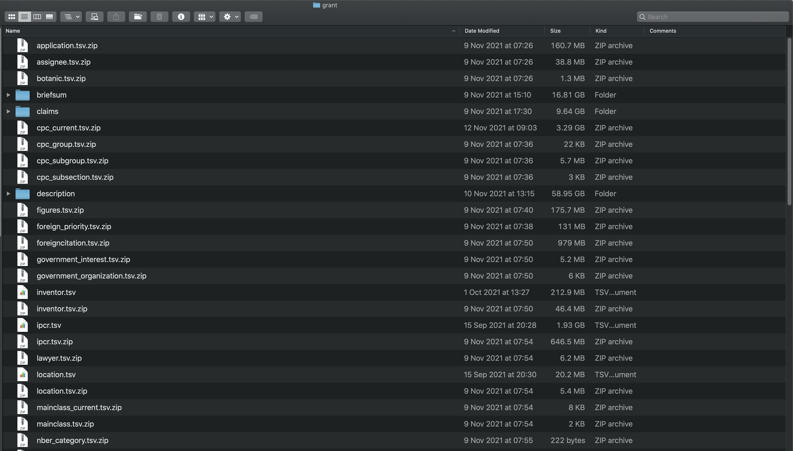

```{r setup, include=FALSE}
knitr::opts_chunk$set(echo = FALSE)
```

## Introduction

In the [last article](https://wipo-analytics.github.io/posts/2022-01-11-patentsview-bulk-data/) we explored how to download USPTO PatentsView patent data files. In the process we used web scraping with the `rvest` package to help us identify the files to download and to keep a record of that we could store with the data. 

In this article we are going to focus on importing the data files into R. While we will use R, a very similar logic will apply if writing this code in Python. 

The USPTO PatentsView data files are a set of zip files that take up around 100 Gigabytes for the granted patents (grants) and a lower 26 GB for applications (called pregrant). In addition to the main tables there are separate yearly download tables for the main text segments of the files consisting of brief summary, the description and the claims. If you have been following along then the entire grant directory should look something like Figure \@ref(fig:grantdir). 

```{r grantdir, echo=FALSE, fig.align='center', fig.cap="Directory Structure for Downloaded Grants Data"}

```
If you want to run the entire US patent collection, including the description, brief summary and claims it is probably best to anticipate around 500Gb of disk space for the full set of files when unzipped. 

The question now is how to import this data.

## Importing the Bulk Data Files

We have a number of choices when planning to import this data. The best choice for your work will partly depend on what you want to do with the data afterwards, in particular how much of this data do you plan to use? In reality there are three main scenarios:

- Scenario 1: I only want to use a small set of the data but need to access some of the larger tables to do that
- Scenario 2: I want to use all of the data but in a fairly static way (e.g. table joins and filters). A database is probably the best solution (e.g. Postgres)
- Scenario 3: I want to do text mining and modelling (a database or an Spark Hadoop cluster will be the best option)

We will address the first scenario in this article and then move to the others in the next articles. 

### Importing the Data Files

In thinking about importing the data files it is important to examine the data structure of the tables. In this case the data is in tab delimited tables files that are compressed using .zip. The USPTO PatentsView team has created a set of import scripts for each file and if you are playing with only one or a couple of files you can use those. However, as they all have the same basic format we might be better off to create a reusable function that will hopefully work for all of them. 

A key issue with the files is that the are in zip format. So, we will want to handle that. There are a number of R packages that can import directly from zip files. The main issues are speed and error handling. 

```{r eval=FALSE, cache=TRUE}
library(readr)
readr::read_tsv("/Users/pauloldham/Documents/patentsview2021/grant/application.tsv.zip")
```
```{r, eval=FALSE}
library(vroom)
application <- vroom::vroom("/Users/pauloldham/Documents/patentsview2021/grant/application.tsv.zip")
```

The data.table package in R is well very popular because it provides a fast and easy way to import data using `fread` including by using command line calls inside the function. 

```{r, eval=FALSE}
library(data.table)

application = data.table::fread(cmd = 'unzip -p /Users/pauloldham/Documents/patentsview2021/grant/application.tsv.zip')
```
`data.table::fread()` is particularly important because it provides informative messages if it runs into problems while importing and will also normally manage to repair common problems. Compared with the two options above fread is our go to if any issues are encountered.


This does not work. Need to unzip to temp and then import. 
```{r}
library(arrow)
#arrow::read_delim_arrow("/Users/pauloldham/Documents/patentsview2021/grant/application.tsv.zip")

```

In thinking about our import options there are two key things to bear in mind

- Are there any parsing errors reported and if so how to interpret them
- Does the import return the expected number of columns and rows (if known in advance)
- Is a checksum available that allows us to establish that the downloaded file is identical to the one we want to import (this is commonly not the case but valuable if available)

### Ensuring we have what we are expecting

In the previous article we used web scraping to create a table that reproduces the content of the website. We can load that in by specifying the path where we are storing it and then take a look. We have preloaded the `gt` package to do this. 

```{r}
library(dplyr)
library(gt)

readme_grants <- readRDS("/Users/pauloldham/Documents/patentsview2021/grant/readme_grant.rds")

readme_grants %>% 
  head() %>% 
  select(zip_name, number_of_rows, everything()) %>% 
  gt()
```


We can see fom this that we have a column with the number of rows and we also have a column with the size (albeit not in a tidy form).

To test whether our imported data frame matches the expected number of rows we need to filter the meta data table to the file name and then count the number of rows and test for equivalence with the number of rows in our imported set. There are a few ways of doing this and this is just one quick way of doing it. 

```{r}
library(dplyr)

readme_grants %>% 
  filter(file_name == "application") %>% 
  .$number_of_rows == nrow(application) # note that is x in the application
```

If we were a bit more organised we could use our metadata readme file to add a column confirming that the rows on import matched (but that would be very organised). We might also separate out the table name field to get the file sizes. However, not that this is not always a reliable measure as depending on the operating system. 

```{r echo = FALSE, eval=FALSE}
# not used as probably messy. 
library(dplyr)
readme_grants %>% 
  separate(table_name, c("nm", "tsv", "zip"), sep = ":", remove = FALSE) %>% 
  View()
```


### Creating an import function

We now have an idea of how to import the bulk data files and how to perform a basic check. 

We now want to write a function that does three things

1. Allows us to import a file
2. Checks the number of rows against the meta data table and stops processing with an informative message if the numbers dont match up
3. Allows us to save the file to a destination of our choice
4. Allows for flexibility in the file format we save too. 

If you have read the earlier article some of the basics of this code will be familiar already.

We start

```{r}
pv_import <- function(path = NULL, meta_path = NULL, save_as = NULL, dest = NULL) {
  
  # get the basename of the file from the path
  # use twice to handle tsv.zip
  
    fname <- tools::file_path_sans_ext(bname) %>% 
    tools::file_path_sans_ext()
  
# identify the metadata table and import
# import the file with vroom specifying the delim and noting that the 
# default quoting is the same as that for the patensview data as "\""
 meta_path <- readRDS(meta_path) %>% 
    dplyr::filter(file_name == fname)
  
  out <- vroom::vroom(x, delim = "\t")

# validate that the imported file has the same length as the metadata
# stop with informative message if not
# Need to handle cases where the metapath is NULL
  
  if (is.null(dest)) {
    
    dest <- getwd()
  }
  
  
  if(nrow(out) == meta_path$number_of_rows) {
    
    usethis::ui_done("Number of Rows Matches the expected {ui_value({meta_path$number_of_rows})} for {ui_value({bname})} in the metadata file} file")
    
  } else {
    
    usethis::ui_stop("{ui_value({nrow(out)} number of rows does not match expected with vroom. Try datatable::fread()?")
    
  }
  
# address case where save_as is TRUE
# use switch to allow user to specify the file type
# need a message where dest is NULL that saving to working directory
# and needs case for working directory
# DEST cannot be null at the moment  
  
  if(!is.null(save_as)) {
    
    if(is.null(dest)) {
      
      # do something here without repeating the chunk below
      
    } else {
      
      
      
      
    }
    
    
  switch(
    save_as,
    rds = saveRDS(out, file = glue('{dest}/{fname}.rds')),
    qs = qs::qsave(out, file = glue('{dest}/{fname}.qs')),
    csv = readr::write_csv(out, file = glue('{dest}/{fname}.csv')),
    rda = save(out, file = glue('{dest}/{fname}.rda')),
    #parquet = arrow::write_parquet(out, sink = glue('{dest}/{fname}.parquet')), # this needs work
    stop("Don't know how to make bizzaro <", cls, ">", call. = FALSE)
  )  
    
  usethis::ui_done("saved data to {ui_value(glue('{dest}/{fname}.{save}'))}")
    
  } else {
    
    out
  }
}
```


If we downloaded some or all of the
