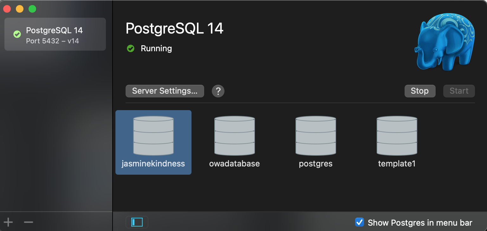
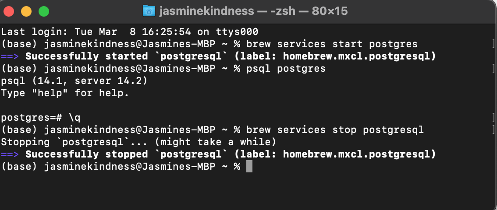

In this post we will cover some of the basics of using PostgreSQL on macOS. This will include some background about what PostgreSQL is and how it works, installation, creation of databases and basic querying.

PostgreSQL is an open-source Database Management Systems (DBMS). It is a software system which is free to use to store, retrieve, and run queries on data. It serves as an interface between an end-user and a database, allowing users to create, read, update, and delete data in that database. 

PostgreSQL is easy to get started with and use, it can also be installed on your local machine which makes it a great way to get to grips with using databases and database querying.  Postgres also has sophisticated features to meet more complex needs, such as Multi-Version Concurrency Control and point in time recovery.

We will first cover installation of PostgreSQL. This tutorial covers installation on macOS but there are plenty of resources available for installing via Windows or Linux. We recommend [this tutorial](https://www.postgresqltutorial.com/postgresql-getting-started/). Although each step will be explained, it is best to have some experience using the Terminal to follow along with this tutorial.

## Postgres.app      `r knitr::include_graphics("postgresappicon.png", dpi = 500)`

The simplest way to download and connect to Postgres is by using Postgres.app. 

Postgres.app is a PostgreSQL installation packaged as a Mac app. It has a simple user interface which allows users to easily start and stop postgres and see whether it's running without needing to use the command line. The app can be downloaded [here](https://postgresapp.com/downloads.html).

Once you have downloaded the app, you will have a default postgres database with a public schema. To connect with psql, double click a database using the user interface. To connect directly from the command line, type psql in the Terminal. This allows users to connect to a database simply by clicking on it, or to initiate or alter databases in the command line as needed. There are also other options if you wish to use a graphical client, detailed [here](https://postgresapp.com).  If you are comfortable using the command line, use of Postgres.app or any graphical client is not essential. Set-up via the command line is covered below.



## Installation via the command line

**Step 1:** Install or update Homebrew
Homebrew is a package management system that simplifies the installation of software on macOS. Essentially it does a lot of the organising and tidying behind the scenes to ensure files are in the right place and reduce the risk of user error. This is what we will use to download PostgreSQL.

To get brew you can copy the following code below onto your terminal:

```{zsh, eval=FALSE}
/usr/bin/ruby -e "$(curl -fsSL https://raw.githubusercontent.com/Homebrew/install/master/install)"
```

If you already have Homebrew installed, update it instead by running the following code on your terminal.

```{zsh, eval=FALSE}
brew doctor
brew update
```

Install PostgreSQL (psql) by running `brew install postgresql` on your Terminal. This may take some time as Homebrew will also install any dependencies needed. Open a new Terminal window to begin using PostgreSQL.

**Step 2:** Starting and stopping PostgreSQL

Depending on your settings, you might need to restart PostgreSQL every time you restart your machine. To start using database services and start the postgreSQL terminal, run the code below in the Terminal:

```{zsh, eval=FALSE}
brew services start postgresql
psql postgres
# To quit the postgres terminal and return to the base terminal:
\q
```



To stop using database services, run the following:

```{zsh, eval=FALSE}

brew services stop postgresql

```


If you haven't explicitly stopped postgres in the Terminal it will continue to listen in the background using port 5432. This can cause issues when swapping between the Terminal and the app. If you ever find your Postgres port is in use by another process, you can use [this tutorial](https://www.btaz.com/mac-os-x/find-the-process-listening-to-port-on-mac-os-x/) to kill the process running on that particular port. 

## Learning more about PostgreSQL

Here we cover some of the basic features of PostreSQL databases.

### Users 

Permissions are handled in PostgreSQL through user roles. These permissions can be extensive or limited, ideally users are only given the permissions they need to complete their tasks. The PostgreSQL operating system itself and individual databases have defined users. 'Superusers' have full permissions to change and alter databases. Users can be created by superusers and have permissions related to either a particular database or databases.  For our purpose we will be using the default superuser, postgres. It is worth noting that the password for any authentication requirements is also postgres. When a new database is created, PostgreSQL by default creates a schema named public and grants access on this schema to a backend role named public. All new users and roles are by default granted this public role, and therefore can create objects in the public schema.

### Schemas

Depending on the complexity and volume of databases you may be using, you may wish to create schemas. A schema is a namespace that contains named database objects. A schema is specific to a particular database and a database can have one or more schemas. This can be useful for when you want to store objects which have the same name but contain different data. Each database has a public schema which is generated by PostgreSQL automatically, whatever object you create without specifying the schema will be placed into the public schema automatically. We will not go further into schemas here, but they are important to be aware of.

# Relational databases

The difference between a data table and a database is that databases will contain multiple data tables. PostgreSQL supports both relational and non-relational querying. This means it supports queries of related tables or of non-tabular data types such as JSON. Relational querying is when a question is asked about data contained in two or more related tables in a database. It specifies the tables required and what the condition is that links them; for example, a matching id field. Relational databases excel in running complex queries and reporting based on the data in cases where the data structure does not change frequently. This is one of the most common uses of PostgreSQL databases.

