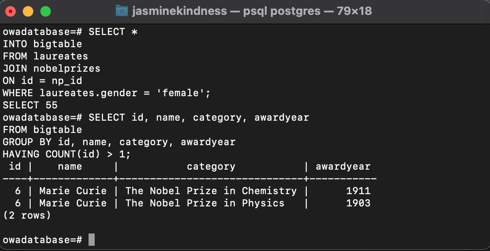

Welcome to the second article in our series on PostgreSQL. In our previous post, found here###, we covered some of the basics of PostgreSQL; what it is, what it's used for and how to install it on macOS. Here we will cover the basics of setting up and querying a PostgreSQL database, including table joins and a few real world challenges you might come across. The data used in this tutorial is originally from the Nobel Prize API, the interface for which can be found [here](https://app.swaggerhub.com/apis/NobelMedia/NobelMasterData/2.1). The datasets can be found here***.

### Step 1: Creating a database

Below we cover some basic commands for creating and interacting with databases. For more comprehensive coverage we suggest this useful [cheat sheet](https://postgrescheatsheet.com/#/databases).

```{r, eval=FALSE, warnings=FALSE, message=FALSE}

# To check the current logged in user (By default this will be the new 
# owner of any databases created):

SELECT current_user;

# To list all databases:

\l

# To connect to any database within postgres:

\c databasename

# To list all tables in the current database:

\dt 

# To list columns and data types in a table:

\d+ tablename

# To create a database called nobel:

CREATE DATABASE nobel;

```

### Creating Tables

PostgreSQL supports multiple different data types. Including:

* Booleans, such as TRUE, FALSE, 0 and 1

* Character types including TEXT, CHAR and VARCHAR

* Numeric types such as INT and NUMERIC 

* Temporal types such as DATE, TIME and TIMESTAMP. 

A full list of data types can be found [here](https://www.postgresql.org/docs/9.5/datatype.html). 

In this exercise we will create two tables, laureates, with personal data about Nobel prize laureates, and nobelprizes with data about Nobel prizes awarded. They are linked by an id field and we will have a go at joining these tables in PostgreSQL below. 

For now let's create the tables, to create each table, initialise a column by naming it and specifying the data type for said column, as below:


```{r, eval=FALSE, warnings=FALSE, message=FALSE}

# Typical structure for creating tables:

CREATE TABLE [IF NOT EXISTS] table_name (
   column1 datatype(length) column_constraint,
   column2 datatype(length) column_constraint,
   column3 datatype(length) column_constraint,
   table_constraints
);

# To delete a table

DROP TABLE table_name;

```

### Importing from csv

In the following we will import our Nobel datasets from csv files into our PostgreSQL database. First we initialise the table with column headings and types to ensure that our data falls into the right place.

One feature of the laureates dataset is that dates where only the year, but not the date is known are entered as YYYY-00-00. This will not be accepted by PostgreSQL, presenting some challenges. One way of tackling this is shown below:

```{r, eval=FALSE, warnings=FALSE, message=FALSE}

# Initialise the table with column names and data types

CREATE TABLE laureates (
id SMALLINT,
name TEXT,
gender TEXT,
birthdate TEXT, 
birthcountry TEXT,
birthcontinent TEXT
);

# This copies the file from its location to the laureates table. The call identifies 
# the file as a csv file with a semicolon delimiter and a header with column names.
# PostgreSQL does not recognise NA values so we tell it to recognise them as NULL

\COPY laureates FROM '~/howtoapi/_posts/queryingpostgres/laureates.csv' WITH 
(FORMAT CSV, DELIMITER ';', NULL 'NA', HEADER);

# The data in our birthdate column won't be accepted by PostgreSQL as a 
# date format. We tackle this is by initialising the column as a TEXT column and 
# converting it to a DATE column after ingesting the data, 
# Postgres will convert any invalid dates to January 1st, for example '1948-01-01'.

ALTER TABLE laureates
ALTER COLUMN birthdate TYPE DATE USING to_date(birthdate, 'YYYY-MM-DD');

# We now initialise the nobelprizes table

CREATE TABLE nobelprizes (
np_id SMALLINT,
awardyear SMALLINT,
category TEXT,
awarddate DATE,
motivation TEXT,
prizeamount INT,
prizeamountadjusted INT
);

# And copy from csv to the database in the same way

\COPY nobelprizes FROM '~/howtoapi/_posts/queryingpostgres/nobelPrizes.csv' WITH 
(FORMAT CSV, DELIMITER ';', NULL 'NA', HEADER);

```

### Querying Tables

Here we cover some basic table queries using our Nobel Prize data. You can try these commands on your own machine.

It's useful to note that in PostgreSQL double quotation marks are interpreted as columns. So postgres will assume queries specifying gender = "female" are looking for results where values in the gender column and the female column are equivalent, throwing an error since there isn't a female column. For character strings always use single quotation marks, so gender = 'female'.

```{r, eval=FALSE, warnings=FALSE, message=FALSE}

# The most fundamental psql command is the following
# which selects all columns:
SELECT *
  FROM tablename;

# You can also select single or multiple columns and add conditions
SELECT name, gender
FROM laureates
WHERE gender = 'female';

# Select all columns and rows from laureates where the 
# gender isn't male and the birth continent is Africa.
SELECT *
FROM laureates
WHERE gender != 'male' AND 
    birthcontinent = 'Africa';

# Select all rows and columns from laureates where the award year is after the millennium.

SELECT * from laureates WHERE awardyear > 2000-01-01 ;

# You can also do counts, for example the below counts the rows in the nobelprizes table

SELECT COUNT(*)
FROM nobelprizes;

```

### Join queries - querying multiple tables

PostgreSQL is at its most powerful when used for relational queries. To query multiple tables is called a join query. We will be using a join query to determine whether any female laureates have won the Nobel Prize more than once.

There are several types of table join, including LEFT JOIN, RIGHT JOIN and INNER JOIN. The type of join you do will determine the data returned. We will be using an equi join, which only returns rows that have equivalent values for the columns specified.

Below we join our laureates and nobelprizes column together on the id column, which is shared between the two tables. We then filter the result by gender, and we store our result in bigtable.

Next, we creates query which selects columns from bigtable, groups them and filters for rows where the id column occurs more than once, meaning there is more than one entry in the database for that person.

```{psql, eval=FALSE, warnings=FALSE, message=FALSE}

SELECT * 
INTO bigtable
FROM laureates
JOIN nobelprizes
ON id = np_id
WHERE laureates.gender = 'female';

SELECT id, name, category, awardyear
FROM bigtable
GROUP BY id, name, category, awardyear
HAVING COUNT(id) > 1;

```


Below we can see that the only female laureate to have won a Nobel Prize twice was Marie Curie, who won in 1903 and again in 1911. 

Impressive!



And that's it! 

Thanks for reading through this introduction to PostgreSQL, We hope you found it helpful. If you'd like to learn more about using PostgreSQL with R specifically, you can follow along with our tutorial here***.
